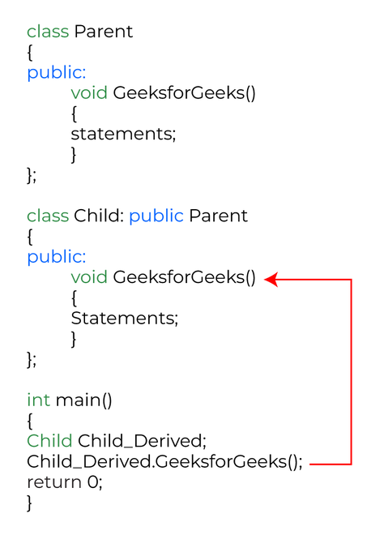

* TOC
{:toc}
# 引言

本篇文章是我在进行C++开发时，遇到问题的汇总，大部分为语法知识，此文长期更新

# 1.怎么理解#if #else #endif

其实也按照if else来理解，大概意思是一样的

但是#if #else #endif 他们是在预处理阶段 ，所以判断为真的那部分代码才进行编译

ex:

```c++
#if CAD_VERSION >= 2018
	代码A部分
#else
    代码B部分
#endif
```

仅当预处理阶段判断CAD_VERSION >= 2018时，才采用代码A，否则采用代码B

另外它的使用场景也可以是判断是否为Linux还是Window平台

假如现在要开发一个C语言程序，让它输出红色的文字，并且要求跨平台，在 Windows 和 Linux 下都能运行，怎么办呢？

这个程序的难点在于，不同平台下控制文字颜色的代码不一样，我们必须要能够识别出不同的平台。

Windows 有专有的宏`_WIN32`，Linux 有专有的宏`__linux__`，以现有的知识，我们很容易就想到了 [if else](http://c.biancheng.net/c/if_else/)，请看下面的代码：

```c++
#include <stdio.h>
int main(){
    if(_WIN32){
        system("color 0c");
        printf("http://c.biancheng.net\n");
    }else if(__linux__){
        printf("\033[22;31mhttp://c.biancheng.net\n\033[22;30m");
    }else{
        printf("http://c.biancheng.net\n");
    }
    return 0;
}
```

但这段代码是错误的，在 Windows 下提示 __linux__ 是未定义的标识符，在 Linux 下提示 _Win32 是未定义的标识符。对上面的代码进行改进：

```c++
#include <stdio.h>
int main(){
    #if _WIN32
        system("color 0c");
        printf("http://c.biancheng.net\n");
    #elif __linux__
        printf("\033[22;31mhttp://c.biancheng.net\n\033[22;30m");
    #else
        printf("http://c.biancheng.net\n");
    #endif
    return 0;
}
```

由于在window和linux平台下有时使用的头文件或者处理方法都不太一样，所以会用到它

这些操作都是在预处理阶段完成的，多余的代码以及所有的宏都不会参与编译，不仅保证了代码的正确性，还减小了编译后文件的体积

这种能够根据不同情况编译不同代码、产生不同目标文件的机制，称为条件编译。条件编译是预处理程序的功能，不是编译器的功能

# 2.#pragma comment是什么

C++中经常有类似这样一行代码

```c++
pragma  comment(lib, "DllTest.lib")
```

\#pragma comment是一个编译器指令，指示 Visual C++ 在生成的对象文件中留下注释。然后，链接器可以在处理目标文件时读取注释
\#pragma comment(lib, "DllTest.lib")告诉链接器将“DllTest.lib”库添加到库依赖项列表中

# 3.在大型项目中为什么不能用using namespace std

在大型项目中，使用using namespace std;会存在以下几个问题：

1. 命名冲突：使用using namespace std;会将所有std命名空间下的名称都引入当前命名空间，可能会与当前项目中的其他标识符冲突，导致编译错误。
2. 可读性差：如果在项目中使用大量的命名空间，代码可能会变得难以阅读和理解，因为不知道哪个标识符映射到哪个命名空间。
3. 可维护性差：在大型项目中，多人协作开发时，每个人编写的代码都可能使用不同的命名空间。如果在一个文件中使用 using namespace std;，则可能导致其他人的代码出现不可预期的结果，从而影响整个项目的质量。

综上所述，虽然使用using namespace std;可以简化代码，但在大型项目中会带来一些潜在问题，因此最好在每个文件中使用全限定名称。

举一个using namespace std;命名冲突的例子

```
#include <iostream>
using namespace std;

class MyClass {
public:
    int cout;
};

int main() {
    MyClass obj;
    obj.cout = 1;
    cout << "obj.cout = " << obj.cout << endl; // 输出的结果不是预期的
    return 0;
}
```

在这个例子中，我们定义了一个名为MyClass的类，它具有一个名为cout的公共成员变量。当我们使用using namespace std;的时候，它会将命名空间std中的所有名字引入到当前的命名空间中，这就包括了名为cout的输出流对象。因此，在我们的类中访问cout变量将不再是我们定义的变量，而是被重命名为std::cout的输出流对象。这就导致了一个名字冲突，从而编译失败。

如何修改这个代码，让它正确

```
#include <iostream>

class MyClass {
public:
    int cout;
};

int main() {
    MyClass obj;
    obj.cout = 1;
    std::cout << "obj.cout = " << obj.cout << std::endl;
    return 0;
}
```

在这个版本的代码中，我们在使用cout对象时使用了std::cout，而不是直接使用cout。这样就避免了与类中定义的数据成员命名冲突的问题。

# 4.为什么C++ 中需要运算符重载

运算符重载的主要目的是为了方便程序员使用自定义类型。在某些情况下，C++的内置类型可能无法满足程序的需要，需要使用自定义类型。在这种情况下，合适的操作符重载可以使自定义类型的操作像内置类型一样自然。

运算符重载的另一个目的是提高代码的可读性和可维护性。操作符重载允许我们在代码中使用一些符号，帮助我们表达代码的目的，而无需使用冗长的函数名称。

此外，C++标准库提供了许多用于处理自定义类型的函数和算法，这些函数和算法通常都使用操作符重载。

------

假设我们有一个自定义的Complex类，表示复数。我们想重载运算符以实现复数加法和复数减法。以下是一个简单的例子实现

```
// Complex 类定义 
class Complex {
private:
    double real, imag;
public:
    Complex(double r=0, double i=0) : real(r), imag(i) {};
    Complex operator+(const Complex& c) {
        return Complex(real + c.real, imag + c.imag);
    }
    Complex operator-(const Complex& c) {
        return Complex(real - c.real, imag - c.imag);
    }
    void print() {
        std::cout << "(" << real << "," << imag << ")" << std::endl;
    }
};

// main 函数
int main ()
{
  Complex a(2.0,3.0);
  Complex b(4.0, 5.0);
  Complex c = a + b; // 调用重载运算符实现 a + b
  Complex d = a - b; // 调用重载运算符实现 a - b
  c.print(); // 输出 (6,8)
  d.print(); // 输出 (-2,-2)
  return 0;
}
```

在这个例子中，我们重载了Complex的加号和减号运算符，以便实现两个复数的加法和减法。我们使用运算符“+”来表示复数加法，用运算符“-”表示减法。运算符重载可以使代码更具有可读性和可重用性。

------

**为什么complex operator + (const Complex& c)**

在 C++ 中，使用 const 关键字可以将对象或指针声明为常量，表示它们的值不可更改。在函数形参中使用 const 关键字，可以避免无意修改参数的值，同时可以提高代码的健壮性和可读性。

在 Complex 类的成员函数 operator+ 函数中，const 关键字用于函数参数 const Complex& c 上。这表示函数不会修改传递给它的参数对象 c 本身。

当我们使用 const Complex& 引用时，我们可以避免复制传递的对象，减少了临时创建副本的时间和空间消耗，提高了程序的效率。而且，使用 const 还可以防止意外修改传递的参数值，使得代码更加安全、可靠。

当我们将该运算符作为成员函数时，该函数只有一个参数。这个参数是我们想要重载的运算符右侧的运算值。因此，使用 const Complex & 在参数前表示我们将不会修改这个参数，并且使用 & 表示我们将以引用方式传递参数，从而避免创建副本并减少程序的开销。

总之，在这个例子中，使用 const 关键字可以为该函数提供一个额外的保障，避免了不必要的错误并提高了代码的可维护性和安全性。

# 5.为什么选用int64_t而不是longlong

int64_t 是 C++ 中的一种整型数据类型，占用 8 个字节（64 位），可以存储的整数范围是从 -9223372036854775808 到 9223372036854775807。它是一种固定长度的数据类型，可以保证在不同的平台上都有相同的位数和取值范围，适用于需要存储大整数的场合。在某些系统中，也可以用 long long int 代替 int64_t。

使用 long long 存储大整数在绝大多数情况下可能是没有问题的，但是在不同的编译器或平台上的实现有可能是不同的，由于 long long 的长度没有明确定义，可能只占有 4 个字节（32 位），而在一些应用场景需要确保整数类型占用的字节数和范围。这就是为什么对于大整数我们会选择使用 int64_t 类型的原因，它是一个标准的、固定长度的整数类型。

那有什么场景是只能用longlong而不能用int64_t的呢

> 在某些不使用补码表示的嵌入式系统中，C++编译器可能不存在 int64_t 类型。此外，如果在其他程序库、运行环境等上下文中定义了某个名为 int64_t 的实体，那么使用 long long 代替 int64_t 可能更明确和安全。

补充问题：int64_t和longlong和__int64

- int64_t是C99标准引入的一种数据类型，可以实现跨平台的可移植性。在32位和64位系统中都使用同一种大小和字节序。该类型定义在<stdint.h>头文件中。
- long long是C99和C++11中的一种基本类型，用于表示64位整数。需要注意的是，该类型并不是在所有平台上都实现为64位的整型，具体实现可以参考编译器文档。
- __int64是Microsoft Visual C++编译器所支持的一种扩展整型类型，用于定义一个有符号64位整型变量。它仅在Microsoft Visual C++编译器中有效，可能不具有跨平台的可移植性。

因此，如果要实现跨平台的可移植性，应该使用int64_t类型。如果使用Microsoft Visual C++编译器，则可以使用__int64类型。而long long可以在大多数情况下使用，但在某些特定平台上可能会与定义不符。

# 6.override关键字表示该函数会覆盖基类中的虚函数

override关键字表示该函数会覆盖基类中的虚函数，即在派生类中重新实现了基类中的同名虚函数。

在C++中，派生类可以重载其父类的虚函数。使用override关键字可以很好地指出该函数是目标函数，因为当以下情况出现时，使用override关键字会在编译时帮助我们检查错误：

如果父类中没有具有相同签名的虚函数，则会发生编译错误。

如果函数签名参数与基类中的虚函数不匹配，则会发生编译错误。

如果该函数非虚函数，则会发生编译错误。

当我们使用override关键字覆盖基类中的虚函数时，我们可以确保函数签名和基类中的虚函数相同，并且将函数定义为virtual函数。这可以提高代码的可读性和可维护性，以及减少在虚函数的调用链中引入错误的风险。

例如，在以下示例中，我们在派生类中使用了override关键字：

```c++
// 基类
class Shape{
public:
    virtual double getArea() const = 0; // 纯虚函数
    virtual std::string getName() const { return "Shape"; }
};

// 派生类
class Circle : public Shape {
private:
    double radius;
public:
    Circle(double r) : radius(r) {}
    double getArea() const override { return 3.14 * radius * radius; } // 实现父类纯虚函数
    std::string getName() const override { return "Circle"; } // 重写父类虚函数
};
```

在这个例子中，我们使用了override关键字来覆盖Shape类中的虚函数 getArea() 和 getName(). 对于函数 getArea(), 我们使用关键字override以实现纯虚函数，在子类中继承必须实现该函数，同时也确保其参数签名与基类相同；对于函数 getName(), 我们再次使用override关键字进行了函数的重写

# 7.C++中的宏

## 7.1C++宏的简单理解

C++中的宏是一种代码片段，可以被宏的值所替换。宏是用#define指令来定义的，用#undef指令来取消定义。宏有两种类型：类对象宏和类函数宏。

类对象宏就像一个常量，只不过不需要分配内存空间。

类函数宏就像一个函数，只不过不需要调用和返回。

大白话来说，宏就是一种让你写代码时更方便、更简洁、更灵活的工具

## 7.2举例说明

假设你想定义一个宏，用来计算两个数的最大值。你可以这样写：

\#define MAX(a,b) ((a)>(b)?(a):(b))

这就是一个类函数宏，它接受两个参数a和b，然后用三目运算符返回较大的那个。

当你在程序中使用这个宏时，比如写：

int x = MAX(3,5);

编译器会在编译之前把宏名替换成宏的定义，也就是：

int x = ((3)>(5)?(3):(5));

这样就可以得到x的值为5

## 7.3类对象宏和类函数宏

- 类对象宏是一个标识符，被一段代码片段所替换。它看起来像一个数据对象，比如一个常量。

例如，你可以这样定义一个类对象宏：

\#define PI 3.14159

这样在程序中使用PI时，就相当于使用3.14159。

- 类函数宏是一个标识符，后面跟着一对括号和一些参数，被一段代码片段所替换。它看起来像一个函数调用，但实际上不是。

例如，你可以这样定义一个类函数宏：

\#define SQUARE(x) ((x)*(x))

这样在程序中使用SQUARE(5)时，就相当于使用((5)*(5))。

## 7.4什么时候用宏呢

宏的使用场景一般是：
当你需要在编译时替换一些常量或表达式，而不是在运行时计算它们。
当你需要定义一些简单的操作，而不想为它们创建函数或模板。
当你需要根据不同的编译选项生成不同的代码，比如调试信息或条件编译。
当你需要使用一些特殊的语法或符号，比如变长参数或字符串化。
但是宏也有很多局限和风险，所以应该谨慎使用，并尽量用C++提供的其他特性来代替它们

## 7.5那么C++提供了哪些特性可以代替宏呢？

C++提供了一些特性可以代替宏，比如：

用inline函数或模板来代替函数式宏，可以保证类型安全和编译优化。
用constexpr或const来代替常量宏，可以避免重复定义和命名冲突。
用using或typedef来代替类型别名宏，可以增加可读性和灵活性。
用enum class或namespace来代替枚举宏，可以提供作用域和强类型检查。
用if constexpr或模板特化来代替条件编译宏，可以实现编译时分支选择。
用字符串字面量或运算符重载来代替字符串化或连接宏，可以实现更自然的语法。

## 7.6还有哪些情况是必须使用宏的呢？

宏在C++中的必要性已经大大降低了，但是还有一些情况是无法用其他特性替代的，比如：

当你需要定义一些编译器或平台相关的常量或标志，比如__FILE__或_WIN32。
当你需要使用一些预处理指令，比如#include或#pragma。
当你需要实现一些复杂的元编程技巧，比如BOOST_PP库。

## 7.7宏和内联函数的区别

宏和内联函数有以下几个区别：

宏是由预处理器展开的，而内联函数是由编译器复制到调用处的。
宏必须在程序开始处定义，而内联函数可以在程序任何地方声明。
宏不能访问类的数据成员，而内联函数可以。
宏没有类型检查和返回类型，而内联函数有。
宏可能会导致副作用和错误，而内联函数不会。

## 7.8代码示例

以下是宏和内联函数的一些代码示例：

```cpp
// 定义一个宏，用于计算两个数的最大值 
#define MAX(a,b) ((a) > (b) ? (a) : (b))
// 定义一个内联函数，用于计算两个数的最大值 
inline int max(int a, int b) { return a > b ? a : b; }
// 调用宏和内联函数 
int x = 10; int y = 20; int z = MAX(x++, y++); 
// z = 21, x = 11, y = 22 
int w = max(x++, y++); 
// w = 22, x = 12, y = 23
```

可以看到，宏会导致x和y被增加两次，而内联函数不会。这是因为宏只是简单地替换文本，而不考虑副作用

为什么宏会导致x和y被增加两次？

这是因为在调用宏的时候，宏的参数会被直接替换到宏的定义中，而不会像函数一样先计算参数的值。所以，当你调用MAX(x++, y++)时，实际上相当于执行了以下代码：

((x++) > (y++) ? (x++) : (y++))

这样就导致了x和y被增加了两次。如果你想避免这种情况，你可以先把x和y的值存储在临时变量中，然后再调用宏。或者你可以直接使用内联函数，因为内联函数会先计算参数的值，然后再复制到函数体中。

详细解释：

首先，你定义了一个宏MAX，用于计算两个数的最大值。然后，你定义了两个变量x和y，分别赋值为10和20。接着，你调用了宏MAX(x++, y++)，并把结果赋值给变量z。这时候，预处理器会把宏的参数x++和y++直接替换到宏的定义中，得到以下代码：

((x++) > (y++) ? (x++) : (y++))

这段代码是一个三元运算符，它的意思是如果x++大于y++，就返回x++的值，否则返回y++的值。注意这里的x++和y++都是后置自增运算符，它们会先返回原来的值，然后再增加1。所以我们可以把这段代码拆分成以下几步：

1.比较x++和y++的值。因为x和y分别是10和20，所以x++返回10，y++返回20。比较结果是false。

2.因为比较结果是false，所以执行三元运算符的第三部分：(y++)。这时候y已经被增加了1，变成了21。所以(y++)返回21，并且再次增加1。

3.把(y++)的结果赋值给z。所以z等于21。

4.因为执行完了三元运算符的第三部分：(y++)，所以跳过第二部分：(x++)。但是这时候x已经被增加了1，变成了11。

5.代码执行完毕。

最终结果是z等于21，x等于11，y等于22（被增加两次）。

# 8.C++中的#pragma once是干什么，和#include guard区别

## 一.

\#pragma once是C和C++编程语言中的一个非标准但广泛支持的预处理指令，用于使当前源文件在单次编译中只被包含一次。它与#include guards有相同的作用，但有一些优点，如：代码更少，避免名称冲突，有时可以提高编译速度

代码例子：

```
// Foo.h``#pragma once``class` `Foo { };
```

这个指令告诉编译器只包含一次Foo.h文件，不管它被导入了多少次。它相当于一个#include guard，但避免了一些问题。请注意，#pragma once不是任何ISO C++标准的一部分，它是编译器特定的

## 二.

\#include guard是C和C++编程语言中的一种特殊构造，用于避免处理#include指令时出现的重复包含问题。它的作用是确保编译器只处理一次某个文件，不管它被包含了多少次。

代码例子：

```
// Foo.h` `#ifndef FOO_H_` `#define FOO_H_` `class` `Foo { };` `#endif //FOO_H_
```

这个指令告诉编译器如果没有定义FOO_H_这个标识符，就定义它，并包含Foo类的代码。如果已经定义了FOO_H\_，就跳过这个文件

FOO_H\_是一个宏，它是通过#define FOO_H\_语句定义的。这个语句告诉编译器，把FOO_H\_替换为一个空值。这样，当编译器再次遇到#ifndef FOO_H\_时，就会检查FOO_H_是否已经被替换过，从而判断是否需要包含Foo.h文件

## 三.区别

- \#include guard是一种标准的预处理指令，可以在所有符合标准的编译器和预处理器中工作。#pragma once是一种非标准的编译器特定指令，可能不被所有的编译器支持。
- \#include guard需要为每个文件定义一个唯一的标识符，而#pragma once不需要。#pragma once只需在文件开头写一行即可。
- \#include guard是通过检查文件内容来防止重复包含，而#pragma once是通过检查文件是否物理相同来防止重复包含。这意味着如果同一个文件在文件系统中有多个别名或拷贝，#pragma once可能会失效，而#include guard仍然可以工作。
- \#pragma once可以让编译器完全跳过已经包含过的文件，而不用再解析它们。这可能会提高编译速度和效率。但是一些编译器也可以对#include guard进行优化，使它们与#pragma once相当

# 9.用lambda表达式按照结构体中的一个字段来排序一个结构体数组

假如结构体如下：

```csharp
struct item {
	int a;
	string b;
};
```

代码：

```cpp
#include <algorithm>
#include <vector>
using namespace std;
 
// 创建一个结构体数组
vector<item> arr = { {3, "c"}, {1, "a"}, {2, "b"} };
 
// 使用lambda表达式来定义比较函数
auto compare = [](item t1, item t2) {
	return t1.a < t2.a; // 按照a字段升序排序
};
 
// 调用sort函数来对数组进行排序
```

# 10.用lambda表达式写一个数组映射

```cpp
#include <iostream>
#include <vector>
#include <algorithm>
using namespace std;
 
int main() {
	// 定义一个整数数组arr，包含五个元素：1, 2, 3, 4, 5。
	int arr[] = { 1, 2, 3, 4, 5 };
	// 定义一个空的向量result，用来存放映射后的结果。
	vector<int> result;
	// 调用transform函数，传入四个参数：
	// arr是源序列的起始位置，也就是指向第一个元素1的指针。
	// arr + 5是源序列的结束位置，也就是指向最后一个元素5之后的位置。
	// back_inserter(result)是目标序列的起始位置，也就是一个插入迭代器，它可以在result的末尾插入新元素。
	// [](int x) { return x * x; }是一个lambda表达式，它定义了映射函数，也就是把每个元素都平方。
	transform(arr, arr + 5, back_inserter(result), [](int x) {
		return x * x;
		});
	// 输出result向量中的元素
	for (int x : result) {
		cout << x << " ";
	}
	cout << endl;
	return 0;
}
```

# 11.到底什么是多态？

“多态性”（polymorphism）一词意味着具有多种形式。 简单来说，我们可以将多态性定义为消息以多种形式展示的能力。
多态性的一个真实例子是一个人可以同时具有不同的特征。 男人同时是父亲、丈夫和雇员。 所以同一个人在不同的情况下会表现出不同的行为。 这称为多态性。 多态性被认为是面向对象编程的重要特征之一。

多态性的类型

- 编译时的多态性
- 运行时的多态性


## 11.1编译时多态性

这种类型的多态性是通过函数重载或运算符重载来实现的。

### A. 函数重载

当有多个同名但参数不同的函数时，这些函数被称为 重载， 因此这被称为函数重载。 来重载函数 可以通过更改参数数量 或/和 更改参数类型 。 简单来说，它是面向对象编程的一个特点，当许多任务列在一个函数名称下时，它提供许多具有相同名称但不同参数的函数。 某些 函数重载规则，重载函数时应遵循

下面是显示函数重载或编译时多态性的 C++ 程序：

```cpp
// C++ program to demonstrate
// function overloading or
// Compile-time Polymorphism
#include <bits/stdc++.h>
 
using namespace std;
class Geeks {
public:
 
	// Function with 1 int parameter
	void func(int x)
	{
		cout << "value of x is " <<
				x << endl;
	}
 
	// Function with same name but
	// 1 double parameter
	void func(double x)
	{
		cout << "value of x is " <<
				x << endl;
	}
 
	// Function with same name and
	// 2 int parameters
	void func(int x, int y)
	{
		cout << "value of x and y is " <<
				x << ", " << y << endl;
	}
};
 
// Driver code
int main()
{
	Geeks obj1;
 
	// Function being called depends
	// on the parameters passed
	// func() is called with int value
	obj1.func(7);
 
	// func() is called with double value
	obj1.func(9.132);
 
	// func() is called with 2 int values
	obj1.func(85, 64);
	return 0;
}
```

输出

```csharp
value of x is 7
value of x is 9.132
value of x and y is 85, 64
```

解释： 在上面的例子中，一个名为 function func() 的函数在三种不同的情况下表现不同，这是多态性的一个特性。

### B. 运算符重载

C++ 能够为运算符提供对数据类型的特殊含义，这种能力称为运算符重载。 例如，我们可以使用字符串类的加法运算符 (+) 来连接两个字符串。 我们知道这个运算符的任务是将两个操作数相加。 因此，单个运算符“+”，当放在整数操作数之间时，将它们相加，当放在字符串操作数之间时，将它们连接起来。

下面是演示运算符重载的 C++ 程序：

```go
// C++ program to demonstrate
// Operator Overloading or
// Compile-Time Polymorphism
#include <iostream>
using namespace std;
 
class Complex {
private:
	int real, imag;
 
public:
	Complex(int r = 0,
			int i = 0)
	{
		real = r;
		imag = i;
	}
 
	// This is automatically called
	// when '+' is used with between
	// two Complex objects
	Complex operator+(Complex const& obj)
	{
		Complex res;
		res.real = real + obj.real;
		res.imag = imag + obj.imag;
		return res;
	}
	void print()
	{
	cout << real << " + i" <<
			imag << endl;
	}
};
 
// Driver code
int main()
{
	Complex c1(10, 5), c2(2, 4);
 
	// An example call to "operator+"
	Complex c3 = c1 + c2;
	c3.print();
}
```

输出

```basic
12 + i9 
```

解释： 在上面的例子中，运算符'+'被重载了。 通常，此运算符用于将两个数（整数或浮点数）相加，但此处使该运算符执行两个虚数或复数的相加。

## 11.2 运行时多态性

这种类型的多态性是通过 Function Overriding 实现的。 后期绑定和动态多态是运行时多态的其他名称。 函数调用在运行时 多态性 中在运行时解析。 相反，对于编译时多态性，编译器在运行时推导后确定将哪个函数调用绑定到对象。

### A. 函数覆盖

当派生类具有基类的成员函数之一的定义时，就会发生函数覆盖。 据说该基本功能已被覆盖。



下面是演示函数覆盖的 C++ 程序：

```csharp
// C++ program for function overriding
#include <bits/stdc++.h>
using namespace std;
 
class base {
public:
	virtual void print()
	{
		cout << "print base class" <<
				endl;
	}
 
	void show()
	{
	cout << "show base class" <<
			endl;
	}
};
 
class derived : public base {
public:
 
	// print () is already virtual function in
	// derived class, we could also declared as
	// virtual void print () explicitly
	void print()	
	{
		cout << "print derived class" <<
				endl;
	}
 
	void show()
	{
	cout << "show derived class" <<
			endl;
	}
};
 
// Driver code
int main()
{
	base* bptr;
	derived d;
	bptr = &d;
 
	// 虚函数绑定在
	// 运行时 (Runtime polymorphism)
	bptr->print();
 
	// 非虚函数绑定在
	// 编译时
	bptr->show();
 
	return 0;
}
```

输出

```python
print derived class
show base class
```

## 11.3虚函数

一个虚函数是 在基类中使用关键字virtual声明并在派生类中重新定义（Overridden）的成员函数。
关于虚函数的一些要点：

```cpp
*虚函数本质上是动态的。
*插入关键字“ virtual ”来定义的，并且总是用基类声明并在子类中被覆盖 它们是通过在基类中
*在运行时调用虚函数 
```

下面是演示虚函数的C++程序：

```cpp
// C++ Program to demonstrate
// the Virtual Function
#include <iostream>
using namespace std;
 
// Declaring a Base class
class GFG_Base {
 
public:
	// virtual function
	virtual void display()
	{
		cout << "Called virtual Base Class function" <<
				"\n\n";
	}
 
	void print()
	{
		cout << "Called GFG_Base print function" <<
				"\n\n";
	}
};
 
// Declaring a Child Class
class GFG_Child : public GFG_Base {
 
public:
	void display()
	{
		cout << "Called GFG_Child Display Function" <<
				"\n\n";
	}
 
	void print()
	{
		cout << "Called GFG_Child print Function" <<
				"\n\n";
	}
};
 
// Driver code
int main()
{
	// Create a reference of class GFG_Base
	GFG_Base* base;
 
	GFG_Child child;
 
	base = &child;
 
	// This will call the virtual function
	base->GFG_Base::display();
 
	// this will call the non-virtual function
	base->print();
}
```

输出

```sql
Called virtual Base Class function
 
Called GFG_Base print function
```

# 12.构造函数中可以调用虚函数吗？

```csharp
class Base
{
public:
	Base()
	{
		Fuction();
	}
 
	virtual void Fuction()
	{
		cout << "Base::Fuction" << endl;
	}
};
 
class A : public Base
{
public:
	A()
	{
		Fuction();
	}
 
	virtual void Fuction()
	{
		cout << "A::Fuction" << endl;
	}
};
 
// 这样定义一个A的对象，会输出什么？
A a;
```

首先回答标题的问题，调用当然是没有问题的，但是获得的是你想要的结果吗？或者说你想要什么样的结果？

有人说会输出：

```cpp
A::Fuction
A::Fuction
```

如果是这样，首先我们回顾下C++对象模型里面的构造顺序，在构造一个子类对象的时候，首先会构造它的基类，如果有多层继承关系，实际上会从最顶层的基类逐层往下构造（虚继承、多重继承这里不讨论），如果是按照上面的情形进行输出的话，那就是说在构造Base的时候，也就是在Base的构造函数中调用Fuction的时候，调用了子类A的Fuction，而实际上A还没有开始构造，这样函数的行为就是完全不可预测的，因此显然不是这样，实际的输出结果是：

```cpp
Base::Fuction  
A::Fuction
```

参考于https://www.nowcoder.com/questionTerminal/4ef1d67edee049c78aa597067c519246

# 13.引用和指针

在C++中，&符号有几种不同的含义，取决于上下文。如果&是引用操作的话，它可以创建一个别名或替代名称来引用另一个变量。例如：

```cpp
int myNumber = 10; 
int& Number = myNumber; // Number is a reference to myNumber 
Number = 25; // This changes both Number and myNumber to 25
```

&也可以用作取地址运算符，它可以返回一个变量的内存地址。例如：

```cpp
int myNumber = 10; 
int* ptr = &myNumber; // ptr is a pointer that stores the address of myNumber 
cout << ptr << endl; // This prints the address of myNumber 
cout << *ptr << endl; // This prints the value of myNumber by dereferencing ptr
int myFirstNumber = 25;
int mySecondNumber = 20;
int &myReference = myFirstNumber;
 
myReference = mySecondNumber;
 
printf("%d", myFristNumber);
```

这段代码的输出是20。原因是：

myReference是myFirstNumber的引用，所以它们指向同一个内存地址。当你把mySecondNumber的值赋给myReference时，你也改变了myFirstNumber的值。所以，当你打印myFirstNumber时，它显示了20，而不是25。

如果你想保留myFirstNumber的原始值，你可以使用指针而不是引用。指针只存储一个变量的地址，而不会改变它的值。

在类中时，引用的值必须由构造函数按以下方式设置：

```css
CMyClass::CMyClass(int &variable) : m_MyReferenceInCMyClass(variable)
{
    // constructor code here
}
```

以下是指针和引用的等价

```javascript
int& Number = myOtherNumber;
Number = 25;
```

它可以用指针等效代码如下：

```cpp
int* pNumber = &myOtherNumber;
*pNumber = 25;
```

# 14.使用数组的指针

可以创建指向数组的指针，这是按如下方式完成的

```cpp
int *pArray;
pArray = new int[6];
```

这将创建一个指针，pArray，并使其指向一个包含六个元素的数组。另一种不使用动态内存分配的方法如下：

```cpp
int *pArray;
int MyArray[6];
pArray = &MyArray[0];
```

请注意，可以简单地编写 MyArray 而不是编写 &MyArray[0]。 当然，这仅适用于数组，并且是它们在 C/C++ 语言中的实现方式的结果。 一个常见的陷阱是写 pArray = &MyArray;，但这是不正确的。 如果你这样写，你最终会得到一个指向数组指针的指针（没有错字），这肯定不是你想要的。
有了指向数组的指针后，如何使用它？ 好吧，假设你有一个指向数组的指针 int。 指针最初将指向数组中的第一个值，如以下示例所示：

```cpp
#include <stdio.h>
 
void main()
{
    int Array[3];
    Array[0] = 10;
    Array[1] = 20;
    Array[2] = 30;
 
    int *pArray;
    pArray = &Array[0];
 
    printf("pArray points to the value %d\n", *pArray);
}
```

为了使指针移动到数组中的下一个值，我们可以说 pArray++. 我们也可以，正如你们中的一些人现在可能已经猜到的那样，说 pArray + 2，这会将数组指针移动两个元素。 需要注意的是，你知道数组的上限是多少（本例中为 3），因为当你使用指针时，编译器无法检查你是否没有越过数组的末尾。 你很容易以这种方式最终导致系统崩溃。 这又是一个例子，这次显示了我们设置的三个值：

```cpp
#include <stdio.h>
 
void main()
{
    int Array[3];
    Array[0] = 10;
    Array[1] = 20;
    Array[2] = 30;
 
    int *pArray;
    pArray = &Array[0];
 
    printf("pArray points to the value %d\n", *pArray);
    pArray++;
    printf("pArray points to the value %d\n", *pArray);
    pArray++;
    printf("pArray points to the value %d\n", *pArray);
}
```

你还可以减去值，因此 pArray - 2 是 pArray 当前指向的位置的 2 个元素。 但是，请确保你对指针进行加减操作，而不是对其值进行加减操作。 这种使用指针和数组的操作在循环中使用时最有用，例如 for或者 while循环。

另请注意，如果你有一个指向值的指针，例如 int* pNumberSet，你可以把它当作一个数组。 例如， pNumberSet[0]相当于 *pNumberSet; 相似地， pNumberSet[1]相当于 *(pNumberSet + 1).

对于数组的最后一个警告是，如果你使用 new，如以下示例所示：

```cpp
int *pArray;
pArray = new int[6];
```

必须用以下方式删除它

```cpp
delete[] pArray;
```

注意删除后的 [] 。 这告诉编译器它正在删除整个数组，而不仅仅是单个项目。 只要涉及数组，就必须使用此方法； 否则，你将以内存泄漏告终。

# 15.指向类的指针

还有一些关于指针的其他注意事项，其中之一是结构或类。 你可以定义一个类如下：

```cpp
class MyClass
{
public:
    int m_Number;
    char m_Character;
};
```

然后，你可以定义一个类型的变量 MyClass如下：

```vbnet
MyClass thing;
```

你应该已经知道了。 如果没有，请尝试阅读该区域。 定义指向的指针 MyClass，你会使用：

```vbnet
MyClass *thing;
```

...如你所料。 然后你会分配一些内存并使这个指针指向内存：

```ini
thing = new MyClass;
```

这就是问题所在：那么你将如何使用这个指针？ 好吧，通常你会写' thing.m_Number，但你不能用指针，因为 thing不是一个 MyClass，而是一个指向它的指针。 所以， thing本身不包含名为 m_Number; 它是它指向的结构包含 m_Number. 因此我们必须使用不同的约定。 这是为了取代 .（点）与 ->（破折号后跟大于号）。 下面是一个示例：

```cpp
class MyClass
{
public:
    int m_Number;
    char m_Character;
};
 
void main()
{
    MyClass *pPointer;
    pPointer = new MyClass;
 
    pPointer->m_Number = 10;
    pPointer->m_Character = 's';
 
    delete pPointer;
}
```

# 16.将指针传递给函数

将指针传递给函数的能力非常有用，但也很容易掌握。 如果我们要编写一个程序，接受一个数字并将其加五，我们可能会编写如下内容：

```cpp
#include <stdio.h>
 
void AddFive(int Number)
{
    Number = Number + 5;
}
 
void main()
{
    int nMyNumber = 18;
    
    printf("My original number is %d\n", nMyNumber);
    AddFive(nMyNumber);
    printf("My new number is %d\n", nMyNumber);
}
```

然而，这样做的问题是 Number提到 AddFive是变量的副本 nMyNumber传递给函数，而不是变量本身。 因此，线 Number = Number + 5将 5 添加到 副本中，将原始变量保留在 变量的 main()不受影响。 尝试运行程序来证明这一点。

为了解决这个问题，我们可以将一个指向数字在内存中保存位置的指针传递给该函数，但我们必须更改该函数，以便它需要一个指向数字的指针，而不是一个数字。 为此，我们改变 void AddFive(int Number)到 void AddFive(int* Number), 添加星号。 这又是程序，做了一些改动。 请注意，我们必须确保我们传递的地址 nMyNumber而不是数字本身？ 这是通过添加 &标志，（你会记得）被读作“地址”。

```cpp
#include <stdio.h>
void AddFive(int* Number)
{
    *Number = *Number + 5;
}
 
void main()
{
    int nMyNumber = 18;
    
    printf("My original number is %d\n", nMyNumber);
    AddFive(&nMyNumber);
    printf("My new number is %d\n", nMyNumber);
}
```

试着想出一个你自己的例子来证明这一点。 注意到 AddFive 函数中 Number 之前的 * 的重要性了吗？ 这需要告诉编译器我们要将 5 加到变量 Number 指向的数字上，而不是将 5 加到指针本身上。 关于函数的最后一点要注意的是，你也可以从它们返回指针，如下所示：

```cpp
int * MyFunction();
```

在此示例中，MyFunction 返回一个指向整数的指针

# 17.指针，动态内存的例子

```cpp
#include <stdio.h>
 
int *pPointer;
 
void SomeFunction();
{
    int nNumber;
    nNumber = 25;    
 
    // make pPointer point to nNumber:
    pPointer = &nNumber;
}
 
void main()
{
    SomeFunction(); // make pPointer point to something
 
    // why does this fail?
    printf("Value of *pPointer: %d\n", *pPointer);
}
```

这个程序的问题：
你没有正确地初始化指针变量pPointer，这可能导致它指向一个无效或随机的内存地址。
你在SomeFunction函数中让pPointer指向一个局部变量nNumber，但是当该函数结束后，nNumber就会被销毁，而pPointer就会成为一个悬空指针（dangling pointer），也就是指向一个已经释放的内存区域。
你在main函数中试图打印*pPointer的值，但是由于pPointer是一个悬空指针，这可能导致未定义行为（undefined behavior），例如程序崩溃或错误输出。
要解决这些问题，你可以尝试以下几个方法：

在声明指针变量时，给它赋一个初始值NULL或nullptr，以表示它不指向任何有效的内存地址。
如果你想让pPointer指向SomeFunction函数中的一个变量，并且在该函数结束后仍然有效，那么你可以使用动态内存分配（dynamic memory allocation），例如使用new运算符来创建一个int类型的对象，并返回它的地址给pPointer。但是请注意，在使用完该对象后，你需要使用delete运算符来释放它所占用的内存空间，以避免内存泄漏（memory leak）。
如果你不想使用动态内存分配，那么你也可以将nNumber定义为一个静态变量（static variable），这样它就不会在SomeFunction函数结束后被销毁，而是一直存在于程序的生命周期中。但是请注意，在多线程环境下使用静态变量可能会导致竞争条件（race condition）或数据不一致（data inconsistency）。

new bing提供的解决办法：

```cpp
#include <stdio.h>
 
int *pPointer; // declare a pointer variable
 
void SomeFunction();
{
    int *nNumber; // declare a pointer to int
    nNumber = new int; // allocate memory for an int object using new
    *nNumber = 25; // assign 25 to the int object
 
    // make pPointer point to nNumber:
    pPointer = nNumber;
}
 
void main()
{
    SomeFunction(); // make pPointer point to something
 
    // print the value of *pPointer:
    printf("Value of *pPointer: %d\n", *pPointer);
 
    delete pPointer; // free the memory allocated by new
}
```

在SomeFunction函数中，我使用了new运算符来为一个int类型的对象分配一块内存空间，并将它的地址赋给nNumber指针。然后我将25赋给该对象，并让pPointer指向nNumber。
在main函数中，我打印了*pPointer的值，并在使用完该对象后，使用了delete运算符来释放它所占用的内存空间。
这样就避免了悬空指针和未定义行为的问题。

原文中的解决办法：

```cpp
#include <stdio.h>
 
int *pPointer;
 
void SomeFunction()
{
// make pPointer point to a new integer
    pPointer = new int;
    *pPointer = 25;
}
 
void main()
{
    SomeFunction(); // make pPointer point to something
    printf("Value of *pPointer: %d\n", *pPointer);
 
    delete pPointer;
}
```
