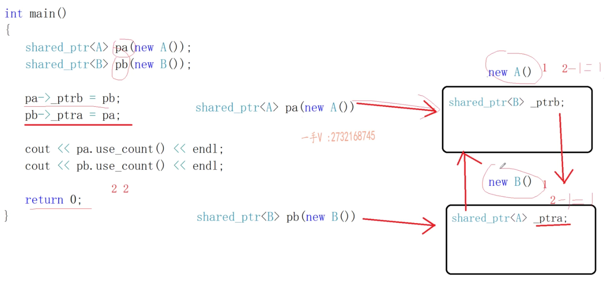

## 实现简易智能指针

```c++
#include<iostream>
using namespace std;

// 智能指针 保证能做到资源的自动释放
// 智能指针实际利用栈上的对象出作用域自动析构的特征，来做到资源的自动释放
// 因为裸指针是个堆，所以需要手动释放对象，现在写成类后，就可以用栈来自动释放对象了
template<typename T>
class CSmartPtr
{
public:
	CSmartPtr(T *ptr = nullptr)
		:mptr(ptr) {}
	~CSmartPtr() { delete mptr; }

	T& operator*() { return *mptr; } //必须是T&，否则不能修改mptr指向的对象的值，反而是会创建一个临时副本，把值传给临时副本，而不是原对象
	T* operator->() { return mptr; }
private:
	T *mptr;
};

int main()
{
	CSmartPtr<int> ptrl(new int);
	*ptrl = 20;// 这一行使用了重载的解引用运算符来访问 ptrl 所管理的 int 对象，并将其值设置为 20。

	class Test
	{
	public:
		void test() { cout << "call Test::test" << endl; }
	};
	CSmartPtr<Test> ptr2(new Test());
	// (ptr2->operator->())->test();
	ptr2->test();
	
	return 0;
}

// 智能指针放在堆上
// CSmartPtr<int> *p = new CSmartPtr<int>(new int); delete p;这时候p是指向堆的智能指针，所以也要手动释放，这样就没啥意义了，还不如直接使用裸指针
// 在这段代码中，p 是一个指向 CSmartPtr<int> 类型的指针。*p 是一个 CSmartPtr<int> 类型的对象。
// 在这里，new int 是一个表达式，它使用 new 运算符动态分配内存来存储一个 int 类型的对象，并返回一个指向该对象的指针。这个指针被传递给 CSmartPtr<int> 的构造函数作为参数
```


## 问题

我们继续看下面的代码

```cpp
CSmartPtr<int> p1(new int);
CSmartPtr<int> p2(p1);
```

这样的话，是会报错的，因为这会造成一个浅拷贝的问题（等以后再详细解释

那么为了解决浅拷贝的问题，我们用不带引用计数的智能指针和带引用计数的智能指针来解决


## 不带引用计数的智能指针

不带引用计数的：是只能一个指针管理资源

auto_ptr:C++库里面的

C++11新标准：scoped_ptr和unique_ptr


首先说auto_ptr

```cpp
auto_ptr<int> p1(new int);
auto_ptr<int> p2(p1);
```

这样是可以正确运行的

但我们继续

```cpp
auto_ptr<int> p1(new int);
auto_ptr<int> p2(p1);
*p2 = 20;
cout << *p1 << endl;
```

这是会报错的，那为什么呢，p1和p2不都是指向同一块内存吗

这时候咱们可以看下auto_ptr的拷贝构造函数看看了

```cpp
auto_ptr(auto_ptr& _Right) noexcept : _Myptr(_Right.release()) {}
```

```cpp
_Ty* release() noexcept {
        _Ty* _Tmp = _Myptr;
        _Myptr    = nullptr;
        return _Tmp;
    }
```

_Right就是咱们传入的p1了，p1调用release后，返回值初始化p2，在源代码里其实就是\_Myptr，\_Myptr查看源码，它是成员变量，也就是auto_ptr封装的裸指针

```cpp
private:
    _Ty* _Myptr; 
```

其实auto_ptr在里面是这样走的，首先是把当前指针p1咱们的值先记下来，然后把当前指针p1改成nullptr，最后再把原来的值返回回去给p2

你把上面源代码release中的_Myptr换成p1就好理解了

但这样就带来了一个问题，那就是auto_ptr每次都是只记住最后一个指针，前面的指针都为空了

但我们的本意是想让p1和p2都可以访问到这个地址，所以这样说的话auto_ptr是有些问题的，所以你也能看到一般也都是不推荐使用auto_ptr

经常会被问到能不能再容器当中使用auto_ptr，其实尽量是别搞

```cpp
vector<auto_ptr<int>> vec1;
vec2(vec1);
```

因为容器在使用过程中，难免会用到容器的拷贝构造或者容器的赋值，而这样的话，会影响容器内每个元素的拷贝赋值

当你用vec1构造vec2的时候，那就说明vec1里面的指针，全部为空，当你在不知道这个的情况下，你使用vec1里面的智能指针，就全部都是空指针了


既然auto_ptr尽量不用，那scoped_ptr呢

我们先看scoped_ptr的拷贝构造函数和拷贝赋值运算符

```cpp
scoped_ptr(const scoped_ptr<T>&) = delete;
scoped_ptr<T>& operator=(const scoped_ptr<T>&) = delete;  
```

这些语句定义了scoped_ptr的拷贝构造函数和拷贝赋值运算符，它们使用了C++11中的关键字来禁用了这些函数

这意味着你不能使用拷贝构造函数或拷贝赋值运算符来创建一个 scoped_ptr对象的副本，如果你尝试这样做，编译器将报错

其实scoped_ptr的拷贝构造函数是被声明为private并且是没被定义的，这意味着你不能使用拷贝构造函数来创建一个 scoped_ptr对象的副本

这是为了防止多个 scoped_ptr对象管理同一个资源，从而避免在其中一个 scoped_ptr对象销毁时释放资源，导致其他 scoped_ptr 对象悬空

所以 scoped_ptr就不能这样写，这样写就是错的

```cpp
scoped_ptr<int> p1(new int);
scoped_ptr<int> p2(p1);  
```


那该怎么办呢，也就只剩下unique_ptr了

我们看它的拷贝构造函数和拷贝赋值运算符

```cpp
unique_ptr(const unique_ptr<T>&) = delete;
unique_ptr<T>& operator=(const unique_ptr<T>&) = delete;  
```

和上面scoped_ptr是一样的，那说明我们这样写也是错的

```cpp
unique_ptr<int> p1(new int);
unique_ptr<int> p2(p1);  
```

但是如果这样写呢

```cpp
unique_ptr<int> p1(new int);
unique_ptr<int> p2(std::move(p1)); 
```

运行后发现是可以的，那是为什么呢

再看它的源码

发现提供了类似这样的函数

```cpp
unique_ptr(unique_ptr &&src)
unique_ptr<T>& operator=(unique_ptr<T> &&src) 
```

这是两个右值引用，简单介绍下右值引用吧

> 右值引用是 C++11 中引入的一种新类型的引用，它绑定到右值（临时对象或将要销毁的对象）上。右值引用通常用于实现移动语义和完美转发。
>
> 右值引用使用 `&&` 符号来声明。例如，下面的代码声明了一个 `int` 类型的右值引用：
>
> ```c++
> int&& rvalue_ref = 5;
> ```
>
> 在这段代码中，我们将一个右值（字面量 `5`）绑定到一个右值引用上。
>
> 你可以使用 `std::move` 函数将左值转换为右值引用。例如，下面的代码声明了一个 `int` 类型的变量，并将其转换为右值引用：
>
> ```c++
> int x = 5;
> int&& rvalue_ref = std::move(x);
> ```
>
> 在这段代码中，我们使用 `std::move` 函数将左值 `x` 转换为右值引用，并将其绑定到一个右值引用上。
>
> 需要注意的是，使用 `std::move` 函数并不会移动对象或释放资源。它只是将左值转换为右值引用，以便可以使用移动构造函数或移动赋值运算符来转移对象的所有权。

所以你可以把代码连起来看

```cpp
unique_ptr(unique_ptr &&src)
unique_ptr<T>& operator=(unique_ptr<T> &&src) 
unique_ptr<int> p1(new int);
unique_ptr<int> p2(std::move(p1)); 
```

unique_ptr(unique_ptr &&src) 是unique的移动构造函数，它接收一个右值引用作为参数。当你使用std::move函数将一个unique_ptr对象转化为右值引用并将其传递给另一个unique_ptr对象来初始化时，就会调用这个构造函数

unique_ptr<T>& operator=(unique_ptr<T> &&src) 是unique_ptr的构造赋值运算符，它也接收一个右值引用作为参数。当你使用std::move函数将一个unique_ptr对象转化为右值引用并将其赋值给另一个unique_ptr对象来初始化时，就会调用这个运算符

第三行代码创建一个unique_ptr\<int\>对象p1，并且使用new int动态分配内存来存储一个int类型的对象

第四行代码创建另一个unique_ptr\<int\>对象p2，并且使用std::move()将p1转化为右值引用并传递给p2的移动构造函数，这样p1的所有权转移给p2，p1变为空指针

三四行代码，不涉及构造赋值运算符，只涉及到移动构造函数


这时候肯定会说，那和auto_ptr也一样啊，但unique_ptr\<int\> p2(std::move(p1)); 的优点在于你知道p1是把所有权转移给了p2（毕竟看到了move），但是auto_ptr你可能都没意识到


## 带引用计数的智能指针

带引用计数：多个指针可以同时管理同一个资源

给每一个对象资源，匹配一个引用计数，当智能指针使用这个资源的时候，引用计数+1，不使用资源的时候，引用计数-1

如果发现这个资源的引用计数为0，说明是最后一个使用这个资源的指针，所以就给它释放掉了

看下面的代码，这份代码实现了所有指针都管理同一份资源，注释我已经写的很详细了，就不继续说了，可以拿过去运行下，一步步跟着走，就知道怎么回事了

```cpp
#include<iostream>
#include <memory>
using namespace std;

// 对资源进行引用计数的类
template<typename T>
class RefCnt // 重新设置count
{
public:
	RefCnt(T* ptr = nullptr)
		:mptr(ptr)
	{
		if (mptr != nullptr)
		{
			mcount = 1;
		}
	}
	void addRef() { mcount++; } // 增加资源的引用计数
	int delRef() { return --mcount; }
private:
	T* mptr;
	int mcount; // 实际sharedptr里面这个是用atomic_int CAS 原子正项位，是保证了加加减减线程安全
};

// 智能指针 保证能做到资源的自动释放
// 利用栈上的对象出作用域自动析构的特征，来做到资源的自动释放
// 因为裸指针是个堆，所以需要手动释放对象，现在写成类后，就可以用栈来自动释放对象了
template<typename T>
class CSmartPtr	// shared_ptr类似，但是我们这里没有考虑多线程因为mcount加加减减的  shared_ptr和weak_ptr都是线程安全，可以直接使用在多线程环境下
{
public:
	CSmartPtr(T *ptr = nullptr)
		:mptr(ptr) 
	{
         // 它创建一个新的RefCnt对象，并使用mptr作为参数来初始化它。然后，它将新创建的RefCnt对象的地址赋值给mpRefCnt成员变量
		mpRefCnt = new RefCnt<T>(mptr);
	}
	~CSmartPtr() 
	{ 
		if (0 == mpRefCnt->delRef())
		{
			delete mptr;
			mptr = nullptr;
		}
		
	}

	T& operator*() { return *mptr; } //必须是T&，否则不能修改mptr指向的对象的值，反而是会创建一个临时副本，把值传给临时副本，而不是原对象
	T* operator->() { return mptr; }

    // 拷贝构造函数
	CSmartPtr(const CSmartPtr<T>& src)
		:mptr(src.mptr), mpRefCnt(src.mpRefCnt)
	{
		if (mptr != nullptr)
			mpRefCnt->addRef();
		
	}
	CSmartPtr<T>& operator = (const CSmartPtr<T>& src)
	{
		if (this == &src)
			return *this;
		if (0 == mpRefCnt->delRef())
		{
			delete mptr;
		}

		mptr = src.mptr;
		mpRefCnt = src.mpRefCnt;
		mpRefCnt->addRef();
		return *this;
	}
private:
	T *mptr; // 指向该资源的指针
	RefCnt<T> *mpRefCnt; // 指向该资源引用计数对象的指针
};


int main()
{
	CSmartPtr<int> ptr1(new int);
	CSmartPtr<int> ptr2(ptr1);
	CSmartPtr<int> ptr3;
	ptr3 = ptr2;

	*ptr1 = 20;
	cout << "ptr2:" << *ptr2 << endl;
	cout << "ptr3:" << *ptr3 << endl;

	return 0;
}
```

简单分析下这个代码

```
	~CSmartPtr() 
	{ 
		if (0 == mpRefCnt->delRef())
		{
			delete mptr;
			mptr = nullptr;
		}
		
	}
```

这段代码是CSmartPtr类的析构函数。当一个CSmartPtr对象被销毁时，它的析构函数会被调用

在这个析构函数中，首先调用mpRefCnt->delRef()来减少指向的对象的引用计数。然后，检查返回的引用计数是否为零。如果引用计数为零，那么指向的对象不再被任何CSmartPtr对象引用，因此可以安全地删除它。这就是为什么调用delete mptr;来删除指向的对象

需要注意的是，这段代码并不会调用指向的对象的析构函数。析构函数是在delete mptr;这一行被调用时自动调用的。

当使用new操作符创建一个新的对象时，会为该对象分配内存，并调用其构造函数来初始化它。当不再需要这个对象时，应该使用delete操作符来删除它。这样做会调用该对象的析构函数来清理它所占用的资源，然后释放为它分配的内存

## shared_ptr的交叉引用问题

shared_ptr：强智能指针，可以改变资源的引用计数

weak_ptr：弱智能指针，不会改变资源的引用计数

简单说，weak_ptr观察shared_ptr，shared_ptr观察资源（内存），这两个指针之前都是boost库里的，后来C++11采用了他们两个

那为什么咱们非得搞出来个强弱呢，这就是牵扯到强智能指针循环引用（交叉引用）的问题

上面的这份代码，咱们自己写的CSmartPtr也是强智能指针，因为可以改变引用计数

看下面这份代码，use_count()是获得引用计数是多少

```
#include<iostream>
#include <memory>
using namespace std;

class B;
class A
{
public:
	A() { cout << "A()" << endl; }
	~A() { cout << "~A()" << endl; }
	shared_ptr<B> _ptrb;
};

class B
{
public:
	B() { cout << "B()" << endl; }
	~B() { cout << "~B()" << endl; }
	shared_ptr<A> _ptra;
};


int main()
{
	shared_ptr<A> pa(new A());
	shared_ptr<B> pb(new B());

	cout << pa.use_count() << endl;
	cout << pb.use_count() << endl;

	return 0;
}

```

pa是一个shared_ptr\<A\>类型的**对象**。shared_ptr是标准库的一个智能指针类

shared_ptr\<A\> pa(new A());这行代码，使用一个new A() 创建了一个新的A类型的对象，并将其地址作为参数传递给shared_ptr\<A\>的构造函数来创建一个新的shared_ptr\<A\>对象，然后这个新创建的shared_ptr\<A\>对象被赋值给变量pa

这也就是说变量pa是一个shared_ptr\<A\>类型的对象，它指向一个新创建的A类型的对象，并管理这个对象的生命周期

输出结果为

```cpp
A()
B()
1
1
~B()
~A()
```

这时候再把代码改成如下

```cpp
shared_ptr<A> pa(new A());
shared_ptr<B> pb(new B());

pa->_ptrb = pb;
pb->_ptra = pa;

cout << pa.use_count() << endl;
cout << pb.use_count() << endl;
```

输入为

```
A()
B()
2
2
```

发现都是2，就算-1的话，也都是1，根本不能达到为0的状态，所以无法去析构函数，这就是循环引用了

现在回答强智能指针循环引用（交叉引用）是什么问题？什么结果？怎么解决？

造成的结果是：造成new出来的资源无法释放，资源泄漏问题！

看下面的图：




shared_ptr\<A\> pa(new A())

shared_ptr\<B\> pa(new B())

这两个都在栈上

new A() 和 new B()

这两个都在堆上

所以最后程序结束时的时候，先减shared_ptr\<B\> pa(new B())；，发现堆内存引用从2到1，再减shared_ptr\<A\> pa(new A())；发现也是从2到1，右边这两个堆内存，只有两个互相指，其他人不知道了，所以就丢了

在上面提到的代码中，由于存在循环引用，pa和pb指向的对象的析构函数不会被调用

因为当pa和pb离开作用域并被销毁时，它们的析构函数会被调用。然而，由于它们指向的对象仍然被对方所引用，因此这些对象的引用计数不会变为零。这意味着，这些对象不会被删除，它们的析构函数也不会被调用

记住只有当引用计数变为0，指向的对象才会被删除，才会调用析构函数

上面这些话可能有点绕，结合我上面对这个代码的分析，可以理解下

```
~CSmartPtr() 
{ 
	if (0 == mpRefCnt->delRef())
	{
		delete mptr;
		mptr = nullptr;
	}
		
}
```


那该怎么解决循环引用的问题呢？

**定义对象的时候，用强智能指针；引用对象的时候，使用弱智能指针**

把上面代码改成这样的

```
// 这是定义对象
shared_ptr<A> pa(new A());
shared_ptr<B> pb(new B());
// 这是引用对象
class B;
class A
{
public:
	A() { cout << "A()" << endl; }
	~A() { cout << "~A()" << endl; }
	weak_ptr<B> _ptrb;
};

class B
{
public:
	B() { cout << "B()" << endl; }
	~B() { cout << "~B()" << endl; }
	weak_ptr<A> _ptra;
};
```

输入结果是

```
A()
B()
1
1
~B()
~A()
```

弱智能指针，只会观察资源，不能改变和使用资源，根本就没有提供运算符重载operator*，重载函数operator-> ，它不能够访问资源和裸指针是不一样的

例如

```
class B;
class A
{
public:
	A() { cout << "A()" << endl; }
	~A() { cout << "~A()" << endl; }
	void testA() { cout<< "非常好用的方法！" << endl; }
	weak_ptr<B> _ptrb;
};

class B
{
public:
	B() { cout << "B()" << endl; }
	~B() { cout << "~B()" << endl; }
	void func()
	{
		_ptra->testA(); //这是错误的，因为只会观察，不能使用资源
	}
	weak_ptr<A> _ptra;
};
```

如果想使用资源则需要这样改

```
void func()
	{
		// _ptra->testA(); 这是错误的，因为只会观察，不能使用资源
		shared_ptr<A> ps = _ptra.lock(); // 提升方法，把弱转为强
		// 但是得判断下是否提升成功，因为提升过程中，可能资源已经被释放了
		if(ps != nullptr)
		{
			ps->testA();
		}
	}
```


## 多线程访问共享对象的线程安全问题

接下来讲讲强弱智能指针的应用

比如C++著名开源网络库muduo库

这涉及到多线程访问共享对象的线程安全问题

首先看这个代码

```
#include<iostream>
#include <memory>
#include <thread>
using namespace std;

class A
{
public:
	A() { cout << "A()" << endl; }
	~A() { cout << "~A()" << endl; }
	void testA() { cout << "非常好用的方法！" << endl; }
};

// 子线程
void headler01(A* q)
{
	q->testA();
}
// main线程
int main()
{
	A* p = new A();
	thread t1(headler01, p);

	// 先让主线程睡上两秒，再去delete p
	std::this_thread::sleep_for(std::chrono::seconds(2));
	
	delete p;

	t1.join();
	return 0;
}
```

输出为

```
A()
非常好用的方法！
~A()
```

把代码改编为如下

```c++
// 子线程
void handler01(A* q)
{
	std::this_thread::sleep_for(std::chrono::seconds(2));
	q->testA();
}
// main线程
int main()
{
	A* p = new A();
	thread t1(handler01, p);
	
	delete p;

	t1.join();
	return 0;
}
```

意思是主线程拉起子线程后，立马释放这个对象指针p，那这时候再去q->testA();还可以吗

实际输出却是

```
A()
~A()
非常好用的方法！
```

事实上，当你在主线程中使用delete删除对象p时，它会释放该对象所占用的内存。但是，这并不意味着该内存立即被操作系统回收或被其他程序使用。因此，即使对象p被删除，子线程仍然可以访问它所在的内存地址并调用它的方法

但是，这样的行为是不安全的，因为在删除对象后访问它会导致未定义行为。在这种情况下，程序可能会崩溃或产生意外的结果。建议使用智能指针来管理对象的生命周期，以避免这种问题

所以咱们得再调用testA的时候，看看A对象是否还活着，这时候就用到了强弱指针

那就在handler传入一个weak_ptr pw,如果A对象不存在，那就不用管了，但是A对象如果存在的话，那就提升pw为强指针，因为它就是指向对象A的

```
void handler01(weak_ptr<A> pw)
{
	std::this_thread::sleep_for(std::chrono::seconds(2));
	// pw访问A对象的时候，需要侦测以下A对象是否存活
	shared_ptr<A> sp = pw.lock();
	if (sp != nullptr)
	{
		sp->testA();
	}
	else
	{
		cout << "A对象已经被析构，不能再访问！" << endl;
	}

}
// main线程
int main()
{
	//这个大括号是作用域
	{
		shared_ptr<A> p(new A());
		thread t1(handler01, weak_ptr<A>(p));
		t1.detach();
	}
	std::this_thread::sleep_for(std::chrono::seconds(20));
	return 0;
}
```

输出为

```
A()
~A()
A对象已经被析构，不能再访问！
```

再改代码

```
void handler01(weak_ptr<A> pw)
{
	// pw访问A对象的时候，需要侦测以下A对象是否存活
	shared_ptr<A> sp = pw.lock();
	if (sp != nullptr)
	{
		sp->testA();
	}
	else
	{
		cout << "A对象已经被析构，不能再访问！" << endl;
	}

}
// main线程
int main()
{
	//这个大括号是作用域
	{
		shared_ptr<A> p(new A());
		thread t1(handler01, weak_ptr<A>(p));
		t1.detach();
		//让主线程等2s
		std::this_thread::sleep_for(std::chrono::seconds(2));
	}
	std::this_thread::sleep_for(std::chrono::seconds(20));
	return 0;
}
```

输出

```
A()
非常好用的方法！
~A()
```


现在讲讲t1.detach为什么在这里有，而t1.join()在这里没有呢

在这段代码中，`t1.detach()` 用于将子线程 `t1` 与主线程分离。这意味着主线程不再等待子线程 `t1` 完成，而是继续执行后面的代码。这样，主线程就可以在子线程 `t1` 运行时继续执行其他任务

由于子线程 `t1` 已经与主线程分离，所以不能再使用 `t1.join()` 来等待子线程完成。如果在分离后调用 `t1.join()`，程序会抛出异常

使用 `detach()` 方法可以让子线程独立运行，但是也会带来一些风险。例如，如果主线程结束时子线程仍然在运行，那么子线程可能会被强制终止，导致资源泄漏或其他问题。因此，在使用 `detach()` 方法时应谨慎


