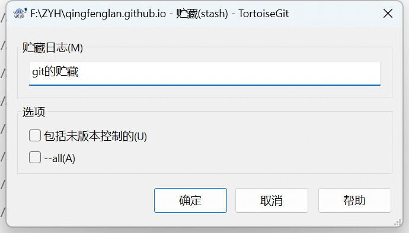
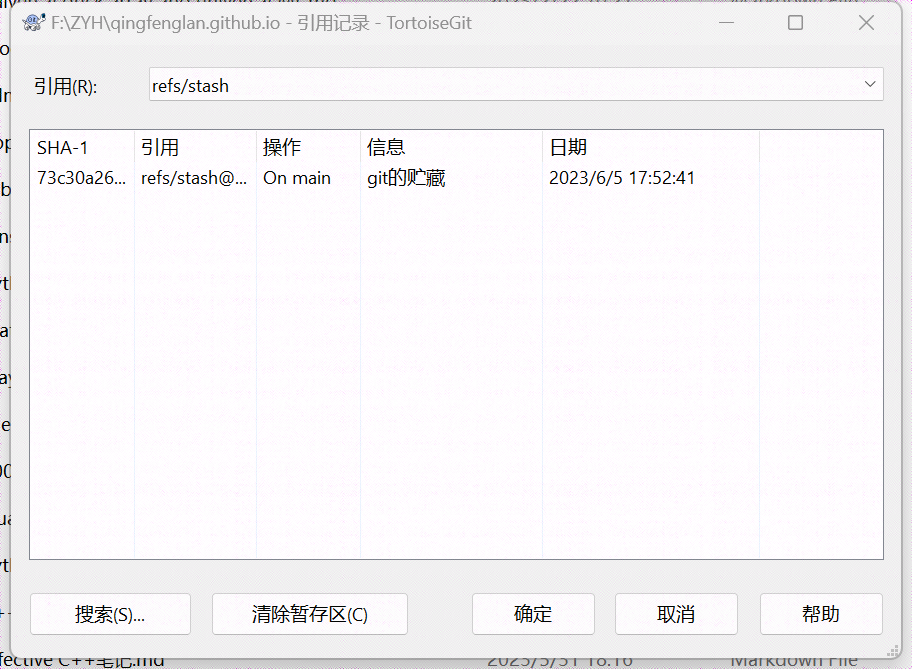

* toc
{:toc}

## 1.引言

有没有经常改完本地代码后，发现改的地方太乱了，但实际只需要修改几处就可以，于是把远端的代码全部强行拉下来，覆盖本地代码，再针对性的修改那几处，让我说，这样你就慢了

## 2.贮藏更改

Tortoisegit有个功能是【贮藏更改】，进入后是这样的

贮藏日志是说你把你修改的东西，命名下，然后先存到一个地方

存完后，你会发现文件夹里的代码就恢复你没有修改时的状态了

此时你再push远端，就可以顺利先把代码拉下来

之前这一步直接push的话，你自己文件夹里修改的代码会和push远端的冲突，现在就没这个担心了，因为现在你文件夹里就是你之前pull的

把代码拉下来后呢，点击【贮藏列表】

这就是你刚才修改后的代码，右击一个日志，会发现有个叫做【应用贮藏】

也很好理解，就是把你刚才藏起来的自己修改的代码，再放进现在最新的本地代码中

注意，如果你刚才修改的和最新的代码修改的是相同的位置，则很有可能冲突，这时候，你就手动解决下冲突代码就可以

如果没有冲突，就会显示贮藏成功

这时候，你再提交，push就可以了

## 3.贮藏的优点

用贮藏的优点在于

- 你可以避免引言说的问题，不用强行覆盖本地代码让其保持最新，而只用先把自己修改的代码藏起来就可以
- 比如你再【应用贮藏】时，起冲突了，你还可以看自己修改的代码和最新代码冲突在哪里，这样不至于冲突后，自己 修改的代码找不到了
- 可以每次修改完代码都贮藏下，这样就知道自己每次修改了什么，比如之前自己只是尝试写了个实验代码，发现成功，但把这个代码删了后面再实验其他的，发现不行，而此时之前的成功代码可能就找不到了

## 4.慎用【弹出贮藏】

因为弹出贮藏会将最近的贮藏应用到你的工作树中，并在应用后从栈中删除它。但是，如果你在弹出贮藏时遇到合并冲突，你需要解决这些冲突才能继续。如果你不小心删除了重要的更改或未能正确解决冲突，这可能会导致问题。因此，在使用弹出贮藏时应谨慎，确保你理解它的工作原理并仔细检查合并冲突

这时候就体现出贮藏日志的作用了，不怕之前修改的丢了，一直在贮藏日志里
