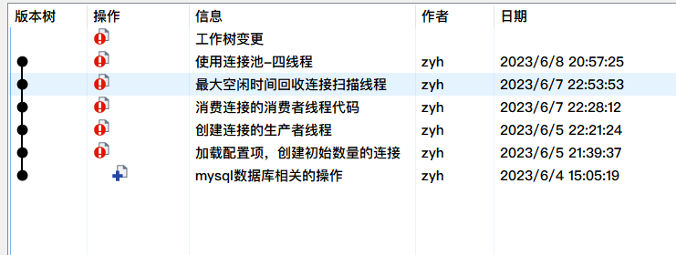

# 1.引言

最近深感C++项目实践经验太少，所以想找个项目练练手，看到MySQL数据库连接池的项目时间比较短，代码行也还行，还能学到锁机制，多线程等，把之前听到的知识都实践一遍，何乐而不为呢！

这个项目是自己下班时候敲的代码，大约为400行，本来想着每次提交下代码就写一篇文章，后来想着算了，直接全干完再写，没想到拖了这么久

# 2.何为数据库连接池

首先一点点来，最初应用程序访问数据库时，都需要建立一个新的数据库连接，建立连接这个过程包括：与数据库服务器建立网络连接、进行身份验证等步骤，这些操作都是非常耗时的。当应用程序使用完这个连接后，它会关闭这个连接，释放相关资源

这种方式的问题在于，如果应用程序需要频繁地访问数据库，那么它就需要不断地建立和关闭数据库连接。这会占用大量的系统资源和时间，降低应用程序的性能

扩展点说，最初应用程序访问数据库的基本流程是需要执行以下步骤的

1.应用程序向数据库服务器发起连接请求。（TCP三次握手）

2.数据库服务器接收到连接请求后，进行身份验证，确认应用程序具有访问数据库的权限。

3.如果身份验证通过，数据库服务器会与应用程序建立一个新的连接。

4.应用程序通过这个连接向数据库发送查询请求，并获取查询结果。

5.当应用程序使用完这个连接后，它会关闭这个连接，释放相关资源。（TCP四次挥手）

比如双11这个时候，有上千万的都来访问，那为一个个请求都建立连接，耗时量是无法想象的

所以这时候连接池出现了

简单讲，就是比如我现在有1万个请求，但是我提前在内存区建立了2万个连接对象，你来了直接拿走用就行，不用再一个个创建了

可以把数据库连接池想象成一个游泳池，里面有很多人在游泳。每个人都代表一个数据库连接。当有新的人想要游泳时，他们可以直接进入游泳池，而不需要重新填充水。当他们游完后，他们可以离开游泳池，但是水仍然留在游泳池中，供下一个人使用。而之前的设计就像是，每个人来了，我都现在给游泳池注水，他游完了，我再把水放了，再进来一个人，我继续注水，这样想是不是发现之前的方式好傻

同样的，数据库连接池在程序初始化时创建一定数量的数据库连接对象并将其保存在一块内存区中。当应用程序需要访问数据库时，它可以直接从连接池中获取一个现有的连接，而不需要重新建立一个新的连接。当应用程序使用完这个连接后，它可以将连接返回给连接池，而不是关闭它。这样，下一个需要访问数据库的应用程序就可以重复使用这个现有的连接

# 3.连接池是怎么设计的

既然我们已经知道了什么是连接池，那连接池应该怎么设计呢，只是简单的提前创建好连接吗

数据库连接池的设计通常包括以下几个方面：

1. 连接池的大小：连接池需要维护一定数量的数据库连接对象。这个数量可以根据应用程序的需求进行配置，以保证应用程序能够快速地获取到可用的数据库连接。
2. 连接的获取和释放：连接池需要提供获取和释放连接的接口。当应用程序需要访问数据库时，它可以调用获取连接的接口从连接池中获取一个可用的连接。当应用程序使用完这个连接后，它可以调用释放连接的接口将连接返回给连接池。
3. 连接的管理：连接池需要对维护的连接进行管理，包括检查连接的有效性、释放空闲时间过长的连接等。这些操作可以通过后台线程定期执行，以保证连接池中的连接都是可用的。
4. 连接池的配置：连接池通常可以通过配置文件进行配置，包括连接池的大小、数据库服务器的地址、用户名和密码等信息。这些配置信息可以在应用程序启动时读取，并用于初始化连接池。

# 4.连接池主要参数

连接池一般包含了数据库连接所用的ip地址、port端口号、用户名和密码以及其它的性能参数，例如初始连接量，最大连接量，最大空闲时间、连接超时时间等，该项目是基于C++语言实现的连接池，主要也是实现以上几个所有连接池都支持的通用基础功能。

初始连接量（initSize）：表示连接池事先会和MySQL Server创建initSize个数的connection连接，当应用发起MySQL访问时，不用再创建和MySQL Server新的连接，直接从连接池中获取一个可用的连接就可以，使用完成后，并不去释放connection，而是把当前connection再归还到连接池当中。

最大连接量（maxSize）：当并发访问MySQL Server的请求增多时，初始连接量已经不够使用了，此时会根据新的请求数量去创建更多的连接给应用去使用，但是新创建的连接数量上限是maxSize，不能无限制的创建连接，因为每一个连接都会占用一个socket资源，一般连接池和服务器程序是部署在一台主机上的，如果连接池占用过多的socket资源，那么服务器就不能接收太多的客户端请求了。当这些连接使用完成后，再次归还到连接池当中来维护。

最大空闲时间（maxIdleTime）：当访问MySQL的并发请求多了以后，连接池里面的连接数量会动态增加，上限是maxSize个，当这些连接用完再次归还到连接池当中。如果在指定的maxIdleTime里面，这些新增加的连接都没有被再次使用过，那么新增加的这些连接资源就要被回收掉，只需要保持初始连接量initSize个连接就可以了。

连接超时时间（connectionTimeout）：当MySQL的并发请求量过大，连接池中的连接数量已经到达maxSize了，而此时没有空闲的连接可供使用，那么此时应用从连接池获取连接无法成功，它通过阻塞的方式获取连接的时间如果超过connectionTimeout时间，那么获取连接失败，无法访问数据库。该项目主要实现上述的连接池四大功能，其余连接池更多的扩展功能，可以自行实现。

# 5.具体实现思路

首先明确写一个文件，注意我写的的github项目里面的ConnectionPool为TestConnectionPool

ConnectionPool.cpp和ConnectionPool.h：连接池代码实现
Connection.cpp和Connection.h：数据库操作代码、增删改查代码实现

1.连接池只需要一个实例，所以ConnectionPool以单例模式进行设计

2.从ConnectionPool中可以获取和MySQL的连接Connection

3.空闲连接Connection全部维护在一个线程安全的Connection队列中，使用线程互斥锁保证队列的线
程安全

4.如果Connection队列为空，还需要再获取连接，此时需要动态创建连接，上限数量是maxSize

5.队列中空闲连接时间超过maxIdleTime的就要被释放掉，只保留初始的initSize个连接就可以了，这个
功能点肯定需要放在独立的线程中去做

6.如果Connection队列为空，而此时连接的数量已达上限maxSize，那么等待connectionTimeout时间
如果还获取不到空闲的连接，那么获取连接失败，此处从Connection队列获取空闲连接，可以使用带
超时时间的mutex互斥锁来实现连接超时时间

7.用户获取的连接用shared_ptr智能指针来管理，用lambda表达式定制连接释放的功能（不真正释放
连接，而是把连接归还到连接池中）

8.连接的生产和连接的消费采用生产者-消费者线程模型来设计，使用了线程间的同步通信机制条件变量
和互斥锁

# 6.Github

写代码之前，首先需要下载mysql，注意要开发者版本的，因为需要用到mysql自带的接口

每增加一个功能我都有次提交，可以复现：[源代码](https://github.com/qingfenglan/TestConnectionPool)

