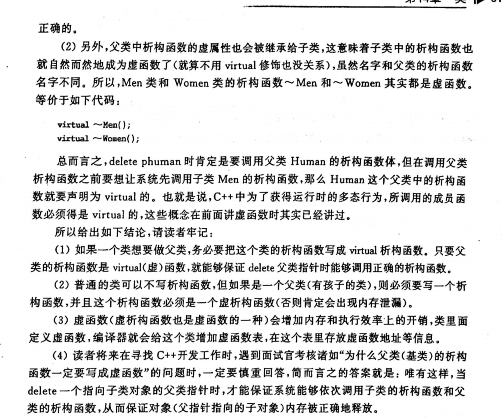

* toc
{:toc}


以下内容是自己近端时间复习C++时，对于一些知识点的简要记录，目的不是为了规范，只是让自己想到哪个点的时候能够回想起来，所以格式比较乱，目前会一直更新


# 1.字符

字符和字符串的问题  /0


# 2.字符串复制

str1 = "China";

str1 = str2;是违法的，得用strcpy

char str1[10] = "one123";这是定义的时候初始化，合法

str1 = "12312";这是赋值，非法


# 3.strcpy

strcpy复制后，有效值在第一个\0上


# 4.strcmp

strcmp一般用于比是否相等

先比asicll码，再比\0

不能这样比字符串

if(str1 == str2)因为是两个地址比较

得这样写if(strcmp(str1,str2) == 0)


# 5.strlen

strlen得到实际长度，不包括\0

每个汉字占两个字节


# 6.外部变量

C语言中函数只能返回一个值

全局变量得定义在使用之前

//extern int a;   int func() {    int b = a;    return b; } int a = 1;

记得外部变量说明不能被初始化，外部变量说明可以多次声明


# 7.变量的划分方式

从作用域分：局部变量和全局变量

从生存期分：静态和动态

局部static 不能被其他函数引用，在静态存储区，编译时赋初值，没有的话默认为0


# 8.全局变量

全局变量的跨文件引用

有两个cpp文件

一个定义int a;

则在另一个cpp里面用他的话得在#include 这个下面加上extern int a;，一般写到这，毕竟引用完你下面才能用a

这样说明a已经在其他地方定义过了，不用再分内存给它

那如果我们不想让其他cpp引用全局变量的话

则static int a;这样的话，就算在另外一个文件extern int a;也会报错的，报无法解析外部符号的错误

并且这样写还有一个优点，就是你如果在两个cpp里面同时定义一个全局变量a，比如都有int a;这是编不过的

除非static int a，这就说明自己的源文件用自己定义的全局变量，互不影响


# 9.static

在函数之前用static，这个函数只能本文件使用


# 10.宏定义

## 10.1不带参数的

\#define #undef 替换

\#define PI 3.14 宏名一般用大写

字符串内的字符即使和宏名一样也不替换


## 10.2带参数

\#define Sub(a,b) a-b

int result = Sub(3,2) 所以就为1

注意

\#define PI 3.14

\#define S(r) PI*r*r

result = S(1+5)

本意是3.14*6*6，但实际是PI\*1+5*1+5

所以加括号

\#define S(r) PI\*(r)*(r)

但注意宏名和带参数之间的括号不能有空格，也就是S和(r)之间不能有空格

如果有空格了就像#define S (r) PI\*(r)*(r)

则代表S替换为(r) PI\*(r)*(r)


## 10.3宏和函数的不用

函数调用是在运行到这个函数的时候才执行，涉及到分内存等，而宏是在编译阶段，并且它也不分配内存

宏的参数没有类型的说法，比如3.14，没有类型，不是说什么int还是double

宏展开只占用编译时间，不占用运行时间，而函数调用占用运行时间（分配内存，传递参数，执行函数体。返回值等）

宏还能替代比较复杂的

\#define MAX(x, y) (x)>(y)?(x):(y)

int result = MAX(3,4);

还能替代多行语句。末尾的"\"用来代表下一行代码和本行代码本是同一行

\#define MACROTEST do{\

printf("test\n"); \

} while(0);


# 11.文件包含

其中头文件一旦改动，就会把包含他的cpp都重新编译一下

因为本质上#include "test.h"是那文件替换，你把头文件动了，那他将来替换到其他cpp里面的源代码也是都动了，所以得重新编译


# 12.条件编译

一般情况下，在生成可执行文件的过程中，源程序文件中的所有代码都参加编译，但有时候希望对其中的一部分内容只在满足一定条件下才进行编译，也就是对一部分内容指定编译的条件，也有的时候，希望当满足某条件时对一组语句进行编译，而当条件不满足时编译另外一组语句，这都叫条件编译

条件编译用的比较频繁，尤其是写一些跨操作系统平台的代码，例如既在window也在linux编译运行，但程序中有些特殊的系统调用函数只能在window下编译 运行或者在linux下编译运行，此时就有必要使用条件编译了

有这几种形式

1)

\#define DEBUG 1

这下面是在main里面

\#ifdef DEBUG

 程序段1

\#else

 程序段2

\#endif

2)

\#ifndef DEBUG

 程序段1

\#else

 程序段2

\#endif

3)

\#define MYPI 1

\#if DEBUG

 程序段1

\#else

 程序段2

\#endif

例子

\#if _WIN32

prinf("是window平台");

\#elif __Linux__

prinf("是linux平台");

\#else

//其他平台

\#endif

其中_WIN32，__Linux__这都会在各自的平台，系统自己定义，不用自己定义的

# 13.直接和间接访问

直接访问：直接通过变量名找到

间接访问：

int i =5;

mypoint = &i;

这个mypoint是用来存i的地址的，但是它本身在内存也有地址的，所以也是占内存的，一般在x86占4字节，在x64占8字节

这个mypoint成为指针变量，专门用来存另一个变量的地址

指针就是一个地址（地址用数字表示）

# 14.指针变量

指针变量是存其他变量地址的便阿玲，也叫该指针变量指向某某变量，如这里的mypoint指向i

变量的指针，就是变量的地址，变量mypoint中保存着变量i的地址，因此变量mypoint就是指向变量i的指针变量

指针变量在定义时，会在定义的语句中引入一个“*”，表示“这是一个指针变量”

int * a1;定义一个指针变量，这个指针变量指向整型变量，指针变量前面有个*，这个是和普通变量最明显的区别

现在要让一个指针变量指向一个整型变量，用赋值语句可以到

a1 = &i;

注意：定义指针变量时，前面有\*，但是使用指针变量时，前面没有\*，所以指针变量名是a1，而不是*a1

int * a1 = & i;这属于定义时候初始化，现在a1指向i

等价于

int * a1;

a1 = &i;

*这个指针运算符不用于定义变量指针的场合时，代表的是它所指向的变量

比如上面的

i = 10;

int * a1 = & i;

printf("%d", * a1); // 10 ，*a1代表i

再提一嘴

(*a1)++等同于i++

\*a1++等同于*(a1++) 

a1++是什么意思呢，我们知道a1就是存的i的地址，那让i的地址++，而由于i是个整型，所以a1++相当于a1要跳过4字节，所以a1不再指向i了，而是指向i后面的内存

那\*(a1++) = 5是什么意思，首先这是将a1所指向的内容赋值为5(因为++是先用后加，所以此时相当于是*a1 = 5)，因为a1开始指向i变量，所以是让i变量的值为5；其次让a1自加1，也就是a1++,导致a1指向i后面的地址，如果i的起始地址是1000，那a1指向的地址现在为1004

指针变量做参数，可以间接在函数汇总改变指针变量所指向的变量的值，从而达到在被调用函数内改变外界变量值的效果

```cpp 
void swap(int* pdest1, int* pdest2)
{    
    int temp; temp = *pdest1;      
    *pdest1 = *pdest2;  //*pdest1实际就是pdest1所指向的变量，也就是a    		*pdest2 = temp; //*pdest2实际就是pdest2所指向的变量，也就是b 
} 

int main() 
{    
    int a = 5, b = 6;    
    int* p1, * p2; 
    p1 = &a; p2 = &b;    
    if (a < b)    
    {   
        swap(p1, p2);    
    }    
    cout << a << b;    
    return 0; 
}
```

记住有一个错误

int * p;

 *p = 5

这是错的，因为p里面还没有存任何地址，也就是说他没有指向任何一个变量，那这个5往哪里存它都不知道

所以这样改就对了

int * p; 

int a; 

p = &a; 

*p = 5;

这样p的内存里面存的就是a的地址了，*p也就是a了，也就是a=5

# 15.指向数组元素的指针

int a[2];

a[0] = 1; a[1] = 2;

int *p;

p = &a[0];//把a[0]元素的地址赋给指针变量p，即p指向数组第0号元素

因为数组名也就是数组首地址，所以

p = &a[0];和p = a;是一样的

定义指针变量时候也可以赋初值，这两行等价

int * p = &a[0];

int * p = a;

```cpp
int a[2]
a[0] = 1; a[1] = 2;
int *p;
p = &a[0];
//引用一个数组元素，目前由于以下几种方法：
a[i],p[i],*[p+i],*(a+i)
```


# 16.指针数组和数组指针

int * p[10]这是指针数组，首先这是个数组，数组里有10个元素，每个元素都是一个指针，每个元素里面是这样的int*

数组指针int (*p)[10] ，表明的是这个是个指向数组的指针，那么该指针变量存储的地址必须是数组的首地址，p是一个指针，指向一个int[10]的数组，每个数组元素是一个int类型的变量

[数组指针和指针数组的区别 - hongcha_717 - 博客园 (cnblogs.com)](https://www.cnblogs.com/hongcha717/archive/2010/10/24/1859780.html)


# 17.字符串

字符串表现形式可以用字符数组表示

char test1[] = "aaaa";

char test2[] = "aaaa";

这是两个内存

也可以用字符指针实现表示

const char * test1 = "aaaa";

const char * test2 = "aaaa";

这是两个指针，但aaaa只占一个内存空间

```cpp
//这个例子难理解
	char a[] = "aaaa";
    char b[100];
    char* c1, * c2; 
    int i;
    c1 = a;
    c2 = b;
    for (;*c1 != '\0'; c1++, c2++)
    {
        *c2 = *c1;
    }
    *c2 = '\0';
    cout << a << endl;
    cout << b << endl;
    return 0;
```

# 18.字符指针变量和字符数组

char str[100] = "aaa";//定义时候初始化

这样写就不行

char str[100];

str = "aaa"; 

修改成这样才可以

strcpy(str, "aaa");

但像字符指针的操作是可以的

const char * a;

a = "aaa";

这是因为aaa是字符串常量，在内存中是有固定地址的，这行只是让字符指针a指向这个地址而已

指针变量的值是可以变的，也就是指针指向的位置可以发生改变，例如

const char*a = "I love China!";

a = a + 7; //原来指向字符“I“，这里跳过7字节，整好指向China

printf("%s",a);//China!

但是数组名虽然代表数组首地址，但是其值不能改变

char a[] = "I love China!";

a = a + 7; //这是错的，因为数组名代表的数组首地址是不能发生改变的

# 19.用函数指针调用函数

```cpp
int max(int x, int y)
{
    if(x > y)
        return x;
    return y;
}

int main()
{
    int c;
    int (*p)(int x, int y);
    p = max;
    c = (*p)(5,19);//等价于c = max(5,19);
    cout << c ; //19
}
```

如果函数指针变量的定义写成了 int * p(int x, int y)，那就说明了：int *表示这个函数的返回值是指向整型变量的指针

上面这一大段代码，看p = max的地址时，发现不一样，其实p保存的才是函数真正的入口地址，VS只是会维护一张表，把max入口地址表保存到表格里，调用的时候才会去取

但是其实你如果输出max的话，就会看到真实地址了

# 20.指向指针的指针

char ** p 定义一个指向“字符串指针变量”的指针变量

# 21.指针数组作为main函数参数

int main(int argc, char * argv[])  第二个参数是个指针数组

调试看，可以看到这个指针数组的长度是1，并且内容就是可执行文件的完整路径文件名

argc是个数字目前是1

有两种方法可以给argv传入参数


# 22.结构体指针

```cpp
struct student {
    string name;
    int age;
};

int main()
{
    struct student stu;
    struct student* ps;
    ps = &stu;
    stu.name = "zyuh";
    cout << (*ps).name << endl;
    ps->age = 10;
     注意一个是->一个是.

}
```

# 23.共用体

内存是最大的，不能同时定义所有的参数，他们的起始地址一样，可以相互覆盖，占用相同的内存，写的形式和结构体一样

# 24.枚举类型

枚举会根据定义的顺序给赋值，第一个是0等等

```cpp
enum color{
    Red,
    Blue
};

enum color Mycolor;
cout << Red //输出是0

//这样是错的
enum color mycolor1
mycolor1 = 1000;
//但这样是对的
mycolor1 = (enum color)1000;
cout << mycolor1 //输出为1000，说明枚举值和整型是互通的
```

# 25.typedef

typedef是定义新的类型名而不是用来定义变量的

typedef int AAA;相当于AAA就是int

AAA a,b,c定义了三个int型变量

也可以来定义结构体

typedef struct date{

int data;

}BBB;

BBB birthday;定义了一个结构体

BBB * p这是一个指向结构体类型的指针

typedef int NUM[100] // 定义NUM为整型数据类型

NUM n; // 定义n为整型数组变量，原来要这样定义int n[100];

typedef char * CCC;

CCC p,q;//之前的话要这样定义 char * p,q

```cpp
总结一下怎么用typedef
1）写出常规的整型变量定义方法
int n[100];
2)将变量名n替换成自己想用的类型名
int NUM[100];
3)在前面加上typedef
typedef int NUM[100];
3)这三步完成后就可以用typedef定义变量了
NUM n;

注意事项：
习惯把typedef定义的名字写成大写，以辨识与C语言本身的int，char等的区别
typedef是定义新的类型名而不是用来定义变量的
typedef是编译时处理的

编译阶段：
预处理：#define #include # ifdef
编译：词法和语法的分析，目标代码的生成，优化typedef
汇编：产生.o(.obj)目标文件
```

# 26.fgetc

fgetc的缺点，如果文本里真有一个-1的话，就会提前结束，所以用feof替代，这是看文件当前位置的指针是否指到文件末尾

# 27.文件操作

```cpp
FILE* fp = fopen("config.txt", "r");
    if (!fp)
    {
        printf("文件打开失败\n");
    }
    else
    {
        char LineBuf[1024];
        while (!feof(fp))
        {
            LineBuf[0] = 0;
            if (fgets(LineBuf, sizeof(LineBuf) - 1, fp) == NULL)
            {
                continue;
            }if (LineBuf[0] == '\0')
            {
                continue;
            }
        lblprocstring:
            if (strlen(LineBuf) > 0)
            {
                if (LineBuf[strlen(LineBuf) - 1] == 10 || LineBuf[strlen(LineBuf) - 1] == 13) {
                    LineBuf[strlen(LineBuf) - 1] = 0;
                    goto lblprocstring;
                }
            }
            if (strlen(LineBuf) <= 0)
            {
                continue;
            }
            printf("%s\n", LineBuf);
        }
        fclose(fp);
    }
```

# 28.保存到文件中的结构体，字节对齐

对于要保存到文件中的结构体，结构体成员中不要出现指针类型成员变量，因为它所指向的内存地址很可能失效，一旦引用了失效的地址会导致程序运行崩溃

```cpp
struct stu {
    char name[30];
    int age;
    double score;
};
```

字节对齐这个问题和编译器有关，像这个结构体，有30+4+8=42个字节，但是在window上用VS的话你看他长度的话是48字节，因为window自动搞成8的整数倍，linux用gcc则是4的整数倍，你再linux上看他是44字节

如果把 这个结构体写入一个文件中，那在window生成后是48字节，再去linux打开时读出来是44字节，显然读出来的数据肯定出错，解决的办法是，定义结构体之前就用"#pragma pack(1)"设置结构体对齐方式是1字节对齐，按1字节对齐的意思就是告诉编译器不要去对齐，实际是多少字节就是多少字节，如果想要恢复默认的字节对齐方式，在定义结构体之后，可以使用"#pragma pack()"取消刚才的设置的对齐，这样不管是什么操作系统，读这个结构体都是42字节

修改后就是这样子

```cpp
#pragma pack(1)
struct stu {
    char name[30];
    int age;
    double score;
};
#pragma pack()
```

# 29.w,r,wb,rb的区别

如果想要文件原封不动的一样，就用加b的

# 30.上面全是C语言的,下面则开始进入C++

# 31.C++文件的后缀名

不同后缀名是因为不同的编译器，.c .cpp .cc .cxx

.hpp是把定义和实现放在一个文件里，有效的减少编译的次数

# 32.<<结合问题

int i =3;

cout << i-- << i-- //输出是23  先用右边的

<<到底是左结合还是右结合，和编译器有关，不同的编译器结果不同，所以避免一行代码多次改变一个变量的值

# 33.int赋值

int a =3

可以写成int a{3}

这样写的好处在哪里呢

int abc = 3.5f编译时候没问题，但执行会发现，3.5的小数部分被截断，所以abc的值是3

int abc{3.5f}，就会在编译时都报错，提前拦截可能的误截断

当然int abc(123)也一样

# 34.auto

auto自动类型推断发生在编译期，所以使用auto不会造成程序运行时的效率降低

# 35.头文件防卫式声明

头文件he34.ad.h有个定义是 int a = 8;

头文件head2.h有个定义是 int b = 5;

主源文件cpp需要用到这两个变量

\#include "head.h"

\#include "head2.h"

int main

{

 cout << a << endl;

 cout << b << endl;

}

现在这个代码没问题

但是因为一些原因head2.h里面需要包含head.h，所以现在head2.h内容是

\#include "head.h"

int b = 5;

这时候编译就会出错了，重定义错误，这是因为现在源文件里面有这个内容：

\#include "head.h"

\#include "head2.h"

展开后就是

 int a = 8;

 int a = 8;

 int b = 5;

a被定义了两次，所以重定义错误

并且像这样的也会重定义错误

\#include "head.h"

\#include "head.h"

怎么解决呢？

首先改造head.h

\#ifndef \_\_HEAD\_\_

\#define \_\_HEAD\_\_

int a = 8;

\#endif

再改造head2.h

\#ifdef \_\_HEAD2\_\_

\#define \_\_HEAD2\_\_

\#include "head.h"

int b = 5;

说明下，每一个头文件的ifndef后面的定义名字都不一样，不能重名

好了现在修改后编译可以运行了

因为用了#ifndef #define #endif的组合，避免了头文件中的内容被多次#include

例如当head.h第一次被#include到cpp里时，#ifndef \_\_HEAD\_\_成立，所以下面的两行代码被#include到cpp里面

\#define \__HEAD__

int a = 8;

但是假如第二次再head.h被#include到cpp里面，#ifndef \_\_HEAD\_\_条件不成立，因为现在前面已经有了#define \__HEAD__，所以这个head.h的内容不被#include到cpp里面，也就避免了重定义错误

所以写头文件的时候，要习惯性在文件头部添加#ifndef #define，在文件末尾添加#endif，这也就是头文件防卫式声明

# 36.引用

引用是为变量起得别名，定义引用不占用内存

int a = 3;

int& b = a;

b = 5;

这是对的

但是像这种是错的

int& aaa;

int& bbb = 10; 

因为定义引用时，必须进行初始化

int a = 3;

int &b  = a;//引用，是&在=左边

int * p = &a;//取地址符，&在=右边

在看引用作为形参

```cpp
void func(int &ta, int &tb)
{
    ta = 4;
    tb = 5;
}
int main()
{
    int a = 13;
    int b =14;
    func(a, b);
    cout << a << " " << b << std::endl;
    return 0;
}
```

# 37.const和constexpr

# 38.避免数据的复制

int v[]{12, 13, 14, 15}

for(auto x : v)

{

cout << x << endl;

}

相当于把v里每个元素都复制到x中

那怎么修改呢

for(auto &x : v)只用修改成这样，用引用的方式，就可以避免数据的复制

一般说，一个容器只要内部支持begin和end成员函数用于返回一个迭代器，能够指向容器的第一个元素和末端元素的后面，这个容器就可以支持范围for语句

# 39.C和C++的内存分配

前者3个，后者5个

# 40.malloc

malloc一般形式是

void * malloc(int NumBytes)

看下面范例

int * p = NULL;

p = (int *)malloc(10 * sizeof(int));

if(p != NULL)

{

*p = 5; //其实只用到了申请40字节的4个字节

cout << *p <

free(p);

}

new/delete比malloc/free做了更多的工作，所以在C++中用new和delete

# 41.指针的初始化

对于指针的初始化，能用nullptr的全部用nullptr

cout << typeid(NULL).name() << endl; //int

cout << typeid(nullptr).name() << endl; //std::nullptr_t

# 42.struct

```cpp
struct student
{
    private:
        int number;
        void func()
        {
            number++;        
        }
}

student stu1;
stu1.number = 1001 //不可以引用
//不可以通过对象名引用结构或类的成员，否则编译时报错
//但是在成员函数func中还是可以直接引用number的，因为成员函数可以直接访问成员变量而不管成员变量是否为private
```

结构体中默认是public，类中则是private，他们的继承也是

# 43.C++中更习惯使用引用类型的形参来取代指针类型的形参

# 44.函数重载

void func1(const int i){}

void func(int i) {}

这样的重载不可以，因为const关键词在比较同名函数时会被忽略，这两个函数相当于参数类型和数量完全一样，所以函数重载不成立，编译链接时会报错

# 45.const char * 和 char const * 和 char * const 三者的区别

都知道char *，那么const分别在char之前，在char和*之间，和*之后

难点，没看懂，在P241页

# 46.函数形参中带const

void func(const student &stu)

{

stu.num = 1010//这就是错误的，不能修改stu的内容

}

void func(cosnt int i) //实参可以是正常的int，形参可以用const int接，这没问题

{

int i = 100; //这也不行，不能给常量赋值

}

把形参写成const的好处

1.可以防止无意中修改了形参值导致实参值被无意中修改掉

2.实参类型可以更加灵活

就像上面那个，实参可以是正常的int，形参可以用const int接，这没问题

形参可以接受多样化的实参类型

在看void func2(int &a){}

func2(123)这是不可以的，必须传递进去一个变量

但是void func2(const int &a){}

func2(123)这样就没问题了，可以传递进去一个常量了

# 47.字符串相关

void func(const student &stu

{

stu.num = 1010//这就是错误的，不能修改stu的内容

}

void func(cosnt int i) //实参可以是正常的int，形参可以用const int接，这没问题

{

int i = 100; //这也不行，不能给常量赋值

}

把形参写成const的好处

1.可以防止无意中修改了形参值导致实参值被无意中修改掉

2.实参类型可以更加灵活

就像上面那个，实参可以是正常的int，形参可以用const int接，这没问题

形参可以接受多样化的实参类型

在看void func2(int &a){}

func2(123)这是不可以的，必须传递进去一个变量

但是void func2(const int &a){}

func2(123)这样就没问题了，可以传递进去一个常量了


string s1 = "abc";

string s2 = "def";

string s3 = "sfa"+"asdf"; //这就不行

string s3 =  "sfa"+s1+"asdf"; //这就可以，中间夹杂一个string对象，因为饮食类型转换，把两个字符串转为string类型

这行相当于是sfa和s1相加后，生成一个临时的string对象，然后再跟asdf相加，再生成临时对象，然后复制给s3

# 48.vector

vector vjihe3; //语法错误，因为vector不能用来装引用，引用只是一个别名而不是对象

```cpp
vector<int> a{ 1,2,3,4,5 };
    for (auto& aaa : a)
    {
        aaa = 2;
    }
    for (auto& aaa : a)
        cout << aaa << endl;
```

注意不要在for循环内改变vector的容量，增加删除元素都是不可以

# 49.迭代器

迭代器可以理解成用来指向容器中的某个元素的，有点像指针

vector iv = {100, 200, 300}; //定义一个容器

vector::iterator iter; //定义迭代器，也必须是vector开头

iterator是什么，它是每个容器（如vector）里面都定义了的一个成员（类型名），这个名字是固定的，请记住

每一种容器，如vector，都绑定了一个叫做begin的成员函数和一个叫end的成员函数

这两个成员函数用来返回迭代器的类型

iter = iv.begin();

iter = iv.end();//end返回的迭代器指向的并不是最后一个元素，而是末端元素的后面，这个后面怎么理解呢，就是end()指向的是一个不存在的元素

end起到了一个岗哨的作用，当从begin开始走，当begin走到end的位置时候，说明遍历完所有元素了


反向迭代器，rbegin，rend

迭代器中的iter++和++iter是同样的功能，让迭代器指向容器中的下一个元素，但是如果已经指向了end，就不能再++了，否则运行报错

--iter和iter--是一样的道理

```cpp
struct student
{
    int num;
};
vector<student> sv;
student mystu;
mystu.num = 100;
sv.push_back(mystu);//把对象mystu复制给了sv容器中
mystu.num = 200;
vector<student>iterator iter;
iter = sv.begin();
cout<<(*iter).num << endl; //100,注意引用方法，*iter是一个结构变量，所以用“.”成员来引用成员
cout <<iter->num <<endl;//100,iter想成一个指针，所以用->引用成员
```


每个容器除了iterator这种迭代器类型，还有另一种迭代器类型叫做const_iterator，这里不能改的意思是，迭代器指向的元素不能改变，而不是迭代器不能变，迭代器还是可以不断指向容器中其他元素的，所以只能读元素，不能改元素，有点像常量指针，而iterator可以读也可以写

如果容器对象是一个常量，那么就必须用const_iterator否则报错


cbegin,cend成员函数，返回的是都是常量迭代器const_iterator;

```cpp
vector<int> iv = { 1,2,3,4,5 };
    vector<int>::const_iterator it;
    for (it = iv.cbegin(); it != iv.cend(); ++it)
    {
        *it = 888; //错误，不能给常量赋值，这说明cbegin返回的是常量迭代器
        cout << *it << endl;
    }
```


迭代器失效

如果在for循环里面插入元素到容器的话，那就必须跳出循环体，不能再继续用这些迭代器操作容器

```cpp
for (auto beg = iv.begin(), end = iv.end(); beg != end; ++beg)
{
    iv.push_back(88);
    break; //立刻跳出循环，这里的beg，end都不能再使用，以免出问题，后续重新用循环重新拿begin和end使用
}
//重新定位迭代器
for (auto beg = iv.begin(), end = iv.end(); beg != end; ++beg)
{
    //....
}
```


如果有需求想不断的插入多条数据，还想让迭代器不失效


# 50.四种C++风格的强制类型转换

# 51.访问类的成员

类的话，如果用类的对象访问，就使用对象名.成员名  来访问成员

如果用指向这个对象的指针来访问，就使用指针名->成员名 来访问成员

```cpp
struct student
{
    int a;
    char name[100];
    void func() {};
};

student stu;
stu.a = 100;
stycpy_s(stu.name, sizeof(stu.name), "zhangsan");

student * pstu = & stu;
pstu->a = 10000;
```

类中public修饰的成员就是类的访问接口，供外界调用

private实现各种功能的细节方法，但不暴露给外界（使用者），使用者无法使用这些private成员

struct默认是public，class则是private

# 52.类声明

类定义放在一个头文件中，而多个cpp文件中都包含这个头文件，那不就相当于这个类定义了多次吗？我们知道一个变量不允许定义多次，一个类难道允许定义多次？这个确实允许的，类是特殊的存在，这一点与定义一个全局变量不同，所以很多人也把类定义称为类声明

# 53.构造函数的参数

1.构造函数的默认参数，也就是Time(int a, int b = 10)，所以b就是默认参数

在具有多个参数时，默认参数都必须在非默认参数的右边，一旦为某个参数指定默认值，则它后面的参数也必须指定默认值

所以可以直接这样调用 Time myTime{12}，也就是a为12

这时候不能再有这样的构造函数Time(int a)，因为系统不知道你是要哪个

2.单参数构造函数的话，总结一下

Time mytime = {16}; 这种写法一般认为是正常的，带一个参数16，可以让系统明确调用带一个参数的构造函数

Time mytime1 = 16; 这就存在临时对象或者隐式转换的问题，因为这相当于调用单参数构造函数，生成一个临时对象，把临时对象的值，赋值到了mytime1的成员变量里

void func(Time myt)

{

return

}

func(16),这也存在临时对象或者隐式转换的问题

用explicit（显式）就可以强制系统明确要求不能做隐式转换

比如把构造函数都加上后，像这种explicit Time(int hour, int min, int sec);

此时Time mytime2 = {12, 13, 14）报错

而Time mytime3 {12, 13, 14)没有报错，能成功创建对象

这说明一个问题：有了这个等号，就变成了一个隐式初始化（其实是构造并初始化），省略这个等号，变成了显式初始化（也叫作直接初始化）

那这样怎么改上面那三个的代码呢

Time mytime = {16}; 

Time mytime1 = 16; 

func(16)

这样改：

Time mytime = Time(16);  //或者Time{16}

func(Time(16)); //临时构造一个对象

总结：一般来说，单参数的构造函数都声明为explicit，除非有特别原因

构造初始化列表

Time::Time(int temphour, int tmpmin, int tmpsec)

:Hour(tmphour), Minute(tmpmin)

尽量不要某个成员变量依赖另一个，比如

Time::Time(int temphour, int tmpmin, int tmpsec)

:Hour(tmphour), Minute(Hour)

因为赋值顺序不是按照这个左右，而是按照成员变量在类的定义顺序

# 54.类的定义中实现的成员函数定义

直接在类的定义中实现的成员函数定义，会被当做inline内联函数来处理，但毕竟这只是对编译器的建议，能不能内联成功，取决于编译器，所以成员函数定义体尽量写的简单一些，增加被内联的概率

# 55.常量成员函数

对于成员函数的声明和实现代码分开的情况下，要记得再成员函数的声明中增加const，也在实现中增加const，都是在成员函数末尾加

加的作用是告诉系统，这个成员函数不会修改该对象里面的任何成员变量的值，也就是这个成员函数不会改变这个对象的状态

这种也叫作常量成员函数

```cpp
void noone() const
{
    Hour += 10; //错误，成员函数不可以修改成员变量的值
}

const Time abc;
abc.addhour(12); //错误，因为addhour成员函数不是const，只能被非cosnt对象调用
abc.noone();//正确，因为noone是const

Time def;
def.noone();//const成员函数，可以被非const和const对象对象，也就是万人迷，而非const成员函数只能被非const对象调用
```

普通函数（非成员函数）末尾不能加const，编译都通不过，因为const在函数末尾的意思是，成员函数不会修改对象里面任何成员变量值，而普通函数没有对象这个概念

# 56.mutable

mutable翻译成中文，是不稳定的，容易改变的意思，与const反着来，而且mutable的引入也是为了突破const的限制

假如咱们写的const成员函数，需要修改成员变量的值，那怎么办，删掉const吗，那这样的话，cosnt对象就不能再调用这个非const成员函数了，所以引入了mutable来修饰一个成员变量，表示这个变量永远处在可变状态，即使在const结尾修饰的成员函数中

```cpp
mutable int myHour;

void noone() const
{
    myHour += 3; //现在就可以修改了
}
```

# 57.static在类里面的作用

static在类里面的作用,定义的变量和函数，是属于类的，而不是属于某个对象的，并且在定义的函数中，与对象有关的成员变量不能出现在它定义的函数中，声明的时候用static，定义的话不用加

# 58.使用类的构造函数初始化列表或在构造函数中给Second值，该值会覆盖掉初始值

例如在类里面已经定义了int Second = 0;

构造函数是这样的

```cpp
Time::Time(int tmphour, int tmpmin, int tmpsec)
                    :Second(tmpsec)    //通过初始化列表来给Second值或者
{
    Second = tmpsec;                 //通过赋值来给Second值                           
}
```

# 59.cosnt成员变量的初始化

对于类的const成员，只能使用初始化列表来初始化，而不能在构造函数内部进行赋值操作

比如在类声明里面，有const int testvalue //当然这里可以给初值，比如const int testvalue = 19;

那么在构造函数定义中，代码应该如下

```
Time::Time(int tmphour, int tmpmin, int tmpsec)
                :Hour(tmphour), Minute(tmpmin), testvalue(18)
{
    testvalue  = 6; //不可以在这里初始化testvalue                                
}
```

上面创建爱你testvalue这种常量属性的变量时，Time构造函数完成初始化以后，也就是Time::Time(int tmphour, int tmpmin, int tmpsec)

​                :Hour(tmphour), Minute(tmpmin), testvalue(18)执行完后，testvalue才真正具备了const属性，在构造testvalue这个const变量（对象）过程中，Time构造函数可以向其内部写值，如上面的testvalue(18)，因为构造函数要进行很多看得见和看不见的写值操作，所以构造函数不能声明为const的

一旦程序员书写了自己的构造函数，那么在创建对象的时候，必须提供与其书写的构造函数形参相符合的实参，才能成功创建对象

14.4.4 默认构造函数这个没看懂，需要重新看

# 60.=default

C++11新特性，=default一般用在默认构造函数中，里面不能有参数 相当于实现了一个函数体{}，如果在头文件写，相当于内联，如果不在头文件写，而在cpp里面写，则不是内联了

=delete，显式禁用某个函数，[C++11中=delete的巧妙用法_= delete_爱就是恒久忍耐的博客-CSDN博客](https://blog.csdn.net/whahu1989/article/details/90648536)

# 61.构造和析构函数参数的情况

一般来说，拷贝构造函数的第一个参数是带const的，当然这不是绝对的


单参数的构造函数，一般声明为explicit，以防止代码模糊不清的问题

拷贝构造函数，一般都不声明为explicit


析构函数不允许有参数存在，一般自己写析构的话，是构造函数里面new了内存，所以析构要及时释放出来

# 62.成员变量初始化

对于类类型成员变量的初始化，能放在构造函数的初始化列表里进行的，千万不要放在构造函数的函数体来进行，这样可以节省很多次不必要的成员函数调用，从而提高不少程序的执行效率

对象中的成员变量不是在析构函数的函数体里面销毁的，而是函数体执行完毕后由系统隐含销毁的

成员变量初始化的时候是在类中先定义的成员变量先进行初始化，销毁的时候是先定义的成员变量后销毁

# 63.父类和子类的函数

先执行父类构造函数，再执行子类构造函数

父类中的private成员不受继承方式的影响，子类永远无法访问  

对于父类来说，尤其是父类的成员函数，如果不想让外面访问，就设置为private，如果想让自己的子类能够访问，就设置为protected，入股偶像公开，就设置为public

# 63.函数遮蔽

函数遮蔽：正常情况下，父类的成员函数只要是用public或者protected修饰的，子类只要不采用private继承方式来继承父类，那么子类中都可以调用，但是在类继承中，只要子类的函数和父类的函数有同名，那无论参数和类型，子类的这个函数都会遮蔽掉父类的同名函数，完全无法调用父类的同名函数了

当然也有方法可以调用父类的，只不过类是这样：   父类：：成员函数名（---）的方式来调用

也可以让using的方式，比如在子类的.h种这样写  using 父类：：函数，换句话说就是让父类的同名函数在子类中以重载的方式使用，这个点还比较复杂，可以看那306页

# 64.父类指针

父类指针new一个子类对象   是可以的，但反过来不行

比如Human * phuman2 = new Men;这是可以的

父类指针很强大， 不仅可以指向父类对象，也可以指向子类对象

但是父类指针没办法调用子类的成员函数

# 65.override

C++11中，可以在函数声明所在行的末尾增加一个override关键字，这个关键字是用在子类中，而且是虚函数专用的

virtual void eat() override;

如果不用父类类型指针，而是用普通对象来调用虚函数，那虚函数的作用就体现不出来了，因为这就不需要运行时（根据new的是哪个类的对象）决定绑定哪个函数，而是在编译时候就能确定的

# 66.多态性

多态性只是针对虚函数说的，非虚函数，不存在多态的说法


# 67.虚函数

纯虚函数是在父类中声明的虚函数，它在父类中没有函数体，只有声明，要求任何子类都要定义该虚函数自己的实现方法

含有纯虚函数的类不允许创建对象，比如Human human;是错误的，这种类叫做抽象类，他们不能用来生成对象，主要目的是为了统一管理子类（或者说建立一套供子类参照的标准或规范）

抽象类中的虚函数不写函数体，而是推迟到子类中去写

抽象类主要是用来做父类，把一些公共接口写成纯虚函数，这些纯虚函数相当于一些规范，所有继承的子类都要实现这些规范（重写这些纯虚函数）

---------

其实压根不需要抽象类（父类），直接子类实现自己的eat接口不就好了，但是如果这样的话，怎么实现多态呢？多态的实现是：父类指针指向子类对象，如果没有父类，也就不存在多态

# 68.父类析构函数为虚函数

用父类指针new一个子类对象，在delete的时候系统不会调用子类的析构函数，这肯定是有问题的

```cpp
Human * phuman = 
```

解决方法就是，把父类Human的析构函数声明为虚函数即可



# 69.不能将“this”指针从“const XXX”转为“XXX &”

如果报不能将不能将“this”指针从“const XXX”转为“XXX &”，  出现上述错误的原因是在**const成员函数**中调用了**非const成员函数**，因此只要将所调用的函数都改成const函数

# 69.友元函数

# 70.RTTI

# 71.不想当基类的类

# 72.静态类型和动态类型

只有基类指针或者引用才存在这种静态类型和动态类型不一致的情况，如果不是积累的指针或者引用，那么静态类型和动态类型永远应该是一致的  P329

# 73.派生类为一个基类对象初始化或者赋值

用派生类对象为一个基类对象初始化或者赋值时，只有该派生类对象的基类部分会被复制或者赋值，派生类部分将被忽略掉

# 74.左值和右值

i = i + 1;

所以一个左值可能同时具有做左值和右值的属性，但是不可能是同时是左值或者右值,只能说具有这种属性

# 75.左值引用和右值引用

左值引用

const & a = 1;

等价于

int b = 1; //可以把b看作一个临时变量

const &c = b;

右值引用是&&，一般用在即将销毁的/临时对象上

例如int && a = 3;

----左值和右值表达式

++i是左值表达式

i++是右值表达式

----右值绑定

所有的变量都要堪称左值，因为他们是有地址的，而且用右值绑定也绑定不上

任何函数里面的形参都是左值，就算是void f(int &&w)这种写法，这里形参w的类型是右值引用（需要绑定到右值），但w本身是左值

临时对象都是右值

----为什么要用右值

为啥用右值呢，它是C++11新加的，可以把它看作一个新的数据类型，主要目的是为了提高效率，怎么实现呢，就是把复制对象变成移动对象，比如之前对象A给对象B的话，是先给B开内存，然后再把A的每个成员赋值给B，这种非常慢，而移动对象是把A的内存块直接给B，然后A去释放，就这样就完事了，之前复制对象的话，有拷贝构造函数，拷贝复制运算符，而移动对象有，移动构造函数和移动复制运算符，只不过前面两个是&，后面两个是&&

# 76.std::move函数

因为move太容易重名了，所以使用时候都带上std::move，不管写没写using namspace std;

string def = std::move(st)是触发了string类的移动构造函数，而对于string && def = std::move(st）并没有触发string类的移动构造函数

# 77.隐式类型转换

```cpp
CTempValue sum;
sum = 1000;
和
CTempValue sum = 100
后者比前者少调用了一次构造函数，一次拷贝赋值运算符，少调用了一次析构函数
后者的=不是赋值运算符，而是“定义时初始化”的概念，这个代码的过程是，在这里定义了sum对象--
--系统为sum对象创建了预留空间，然后用1000调用构造函数来构造临时对象，但是这个构造是在预留空间里进行的，所以并没有真正的产生临时对象
```

C++只会为const引用(const string& aaa)产生临时对象,而不会为非const引用string& aaa产生临时对象

void test(const string& aaa)

临时对象就是一种右值

P347页可以好好看看

# 78.一般一个函数只要返回一个对象，一般都会产生临时对象

```cpp
CTempValue Double(CTempValue & ts)
{
    CTempValue tmpm;
    tmpm.val1 = ts.val1 * 2;
    tmpm.val2 = ts.val2 * 2;
    return tmpm;
}
优化后的代码应该是这样的
CTempValue Double(CTempValue & ts)
{
  return CTempValue(ts.val1 * 2, ts.val2 * 2);
}
这样少了一次拷贝构造和一次析构
```

14.14再好好看看

# 79.引用静态变量的方式

对象名引用静态变量用小数点

test.a

类引用的话，是冒号

Test::a

# 80.多重继承

多重继承的话，构造函数的顺序，是按照继承时候写的顺序来

能用单一继承的问题不用多重继承

class A : virtual public Grand(---)虚继承，作用是不让派生类拥有多个基类的部分，其中virtual和public可以互换位置

一旦Grand成为虚基类后，Grand类的初始化工作就不会再由它的直接子类A，A2来初始化了，而是最下层的来初始化

# 81.类型转换构造函数

类型转换构造函数，把别的转为这个类的类型

```cpp
class TestInt
{
    public:   
        TestInt(int x = 0) : m_i(x)
        {
            if(m_i < 0) m_i = 0;
            if(m_i > 100) m_i = 100;        
        }
    public:
        int m_i;
}
在main主函数中，加入如下代码
TestInt ti = 12;//隐式类型转换，将数字转化为TestInt对象（调用类型转换构造函数）
TestInt ti2(22);//调用类型转换构造函数，但这个不是隐式类型转换
如果不希望发生隐式类型转换，可以增加explicit，这是禁止隐式转换
explicit TestInt(int x = 0) : m_i(x)
既然用了禁止隐式，则代码也要改改
TestInt ti = TestInt(12);

接下来是类型转换运算符，可以当作是类的一个成员函数，把类转为别的类型
public:
    operator int () const
    {
        return m_i;//返回的就是一个int类型，可以把该类对象转换为int类型    
    }
在main主函数中，写这个
ti2 = 6;
int k = ti2 + 5; k=11，这里调用operator int()将ti2转为int，结果为6，在和5做加法，结果给k
int k2 - ti2.operator int() + 5;.//也可以显式调用，注意写法，没有形参，所以括号内为空

```

无论把其他类型转为类类型，还是反过去转换，尽量都少用，因为代码难读懂，并且有二义性，二义性就是怎么样都行，所以编译器不知道怎么做了

例如

```cpp
operator int() {}
operator double() {}
此时在main主函数中
TestInt aa;
int abc = aa + 12; //会产生二义性错误
```

# 82.类成员指针

1.对于普通成员函数

定义普通成员函数指针：  类名::*函数指针变量名字

获取类成员函数地址： &类名::成员函数名

```cpp
class Test
{
    public:
        void myfunc(int temp) { };
}
在main主函数中
void (Test:: *pfunc)(int); //类成员函数指针变量的定义，变量名字是pfunc
pfunc = &Test::myfunc; //类成员函数指针变量被赋值
```

对于类对象调用成员函数：  类对象名.*函数指针变量名字

对于类对象指针调用成员函数：  指针名->*函数指针变量名字

例如

```cpp
CT ct, *pct;
pct = &ct;
(ct.*pfunc)(100);
(pct->*pfunc)(200);
```

2.对于虚成员函数

和普通成员函数调用方法一样，只不过这个指针指向的是虚函数地址，因为类中有虚函数，会产生一个虚函数表

3.对于静态成员函数

声明静态成员函数指针：  *函数指针变量名

获取类成员函数地址： &类名::成员函数名

因为静态成员是跟着类走的，所以在类里相当于是全局的，所以不用再用类名：：来限定作用域

```cpp
void (* myfpointstatic)(int) = &CT::staticfunc; //定义一个静态的类成员函数指针并给初值
myfpointstatic(100); //直接使用静态成员函数指针名即可调用静态成员函数
```

# 83.类成员变量指针

1.对于普通成员变量

```cpp
public:
    int m_a;
在main主函数中
int CT::*mp = &CT::m_a;
```

跟踪调试发现这个指针并不是真正意义的指针，他不是指向内存的地址，而是这个成员变量和该类对象首地址之间的偏移量

2.对于静态成员变量

则是一个真正的地址，当然也不用加CT这个类作用域

# 84.函数模板

```cpp
第一种
template<typename T> //这T是类型参数

第二种
看看非类型参数怎么用
template<int a, int b>
int func()
{
    int add = a + b;  
    return add;
}
在main中
int result = func<1, 2>;

第三种
template<typename T, int a, int b>
int func(T c)
{
    int add = (int)c + a + b;
    return add;
}
在main中
int result = func<int, 11, 12>(13)   13是实参，int是类型参数
13和int对应，所以就传进去了，如果不是13，而是13.3，那会以<>里面的为准，而不是13

第四种，感觉没见过，所以先不写了
```

# 85.类模板

类模板的所有信息，不管是声明还是实现等内容，必须全部写到一个头文件里，因为实例化具体类的时候，需要知道类的所有信息

记住vector才是一个完整的类型

```cpp
#pragma once
#ifndef __MYVECTOR__
#define __MYVECTOR__

template<typename T>
class myvector
{
public:
    typedef T* myiterator;

public:
    myvector();
    myvector& operator = (const myvector&);

public:
    myiterator mybegin();
    myiterator myend();

public:
    void myfunc();
};

template<typename T>
void myvector<T>::myfunc()
{

}

template<typename T>
myvector<T>::myvector()
{

}
#endif
```

在类模板内部，可以直接使用类模板名，而不需要在类模板名后跟模板参数，因为在类模板定义内部，如果没提供类模板参数，编译器会假定类模板名带与不带模板参数等价，也就是myvector等价于myvector

当然非要在后面跟模板参数也行

myvector&operator=(const myvector&)

但是假如在类模板定义外实现这个运算符重载，则需要这样写，需要加上模板参数T，这种写法是套路，记住就行

template

myvector& myvector::operator = (const myvector&)

{

return *this;

}

使用非类型的模板参数

```cpp
template<typename T, int size = 10>
class myarray
{
private:
    T arr[size];

public:
    void myfunc();
};

template<typename T, int size>
void myarray<T, size>::myfunc()
{
    std::cout << size << std::endl;
    return;
}
```

但这种一般有参数限制，例如浮点型一般不能做非类型模板参数

例如这个就不行

```cpp
tempalte<typename T, double size>
class myarray{---};
```

类类型也不能做非类型模板参数，例如

```cpp
class a
{
    
};
template<typenmae T, a Size>
class myarray{---};
```

# 86.typenmae的场合

1.在模板定义里，表明其后的模板参数是类型参数

```cpp
template<typename T, int a, int b>
int funcaddv2(T c){---}
```

2.2.用typename标明这是一个类型（类型成员），这个我没看懂，不太明白，但好像也没怎么见过，所以先放着

# 87.函数指针作为其他函数的形参

```cpp
int mf(int tmp1, int tmp2)
{
    return 1;
}

typedef int(*FunType)(int, int);

void testfunc(int i, int j, FunType funcpoint)
{
    //可以通过函数指针调用函数
    int result = funcpoint(i, j);
    cout << result << endl;
}

int main()
{
    testfunc(3, 4, mf);

    return 0;
}
```

其中typedef定义函数指针

```cpp
typedef int (*FunType)(int,int);
```

# 88.函数模板趣味用法举例

可以推断出对象，这里用到了可调用对象的概念

```cpp
int mf(int tmp1, int tmp2)
{
    return 1;
}

typedef int(*FunType)(int, int);

template<typename T, typename F>
void testfunc(const T& i, const T& j, F funcpoint)
{
    cout << funcpoint(i, j) << endl;
}

class tc
{
public:
    tc() { cout << "构造函数" << endl; }
    tc(const tc& t) { cout << "拷贝构造函数执行" << endl; }
    // 重载圆括号
    int operator()(int v1, int v2) const
    {
        return v1 + v2;
    }
};

int main()
{
    tc tcobj;
    testfunc(3, 4, tcobj);//这里只调用拷贝构造函数
    return 0;
}
```

执行了一次tc的构造函数和重载圆括号

# 89.默认模板参数

函数参数有默认值，模板参数也可以有默认值

```cpp
template<typename T = string, int size = 5>
class myarray {---};
调用的话
myarray<> abc;
```

上面是类模板

下面看看函数模板

现在有这个需求

希望用这个调用方式testfunc(3,4);就可以调用函数模板testfunc，也就是说，最后一个模板参数并没有提供

```cpp
template<typename T, typename  F = tc>
void testfunc(const T&i, const T&i, F funcpoint = F())
{
    cout << funcpoint(i, j) << endl;
}
```

这就等价于

```cpp
void testfunc(const int&i, const int&j, tc funcpoint = tc())
{
    cout << funcpoint(i, j) << endl; 
}
```

# 90.成员函数模板

不论是一个普通的类，还是一个类模板，他成员函数本身可以是一个函数模板，这种成员函数称为“成员函数模板”，但是这种成员函数模板不可以是虚函数，如果是虚函数，则编译器报错

1.普通类的成员函数模板：

```cpp
class A{
    public:
        template<typename T>
        void myft(T tmpt)
        {
            cout << tmpt << endl;        
        }
}
```

2.类模板的成员函数模板

```cp
template<typename C>
class A
{
public:
    template<typename T2>
    A(T2 v1, T2 v2) //构造函数也引入自己的模板参数T2，和整个类的模板参数C没有关系
    {

    }
    template<typename T>
    void myft(T tmpt)
    {
        cout << tmpt << endl;
    }
    C m_ic;
};
```

如果想把成员函数模板的实现代码写到类模板定义外面，应该这样写

```cpp
template<typename C>
class A
{
public:
    template<typename T2>
    A(T2 v1, T2 v2); //构造函数也引入自己的模板参数T2，和整个类的模板参数C没有关系
    template<typename T>
    void myft(T tmpt)
    {
        cout << tmpt << endl;
    }
    C m_ic;
};
template <typename C> // 先跟类模板的模板参数列表，要排在上面（如果排在下面会报错）
template <typename T2> // 再跟构造函数模板自己的模板参数列表
A<C>::A(T2 v1, T2 v2)
{
    cout << v1 << v2 << endl;
}
```

# 91.模板显式实例化与声明

前面已经说过模板只有被使用时才会被实例化

就是上面的A类模板，如果放在一个h文件中，有两个cpp同时调用这个h文件，并且都实例化的话，其实是会实例化两个出来的，如果项目很大，有多个cpp，则会实例化很多相同的类模板，开销也很大，增大了编译的时间

可以通过显式实例化来避免这种生成多个相同类模板实例的开销

可以在第一个cpp文件头写上

```cpp
template A<float> //这叫实例化定义，只有一个cpp文件这样写，编译器为其生成代码
其他cpp的头上声明这个实例化出来的类就行了
extern template A<float> //其他的cpp都这样写
```

在头上写，是因为编译器遇到这些使用类模板的代码会自动会对模板实例化，所以在cpp头上写的代码肯定比那些使用该类模板的代码先执行到

带extern的代码行，成为模板实例化声明，extern的意思就是告诉编译器，其他的cpp已经有一个类的实例化版本了

template A是类的实例化定义

extern template A是类的实例化声明

只有一个定义，但是可以有多个声明

但是一旦用template A 进行显式实例化的话，系统会把这个类模板以及所有成员函数都给实例化出来（感觉这样并不好），包括内联的成员函数，同时如果代码中调用了哪个函数模板，那么系统也会把这个函数模板根据所调用的参数实例化出来

使用VS17和19的话，不推荐使用类模板显式实例化特色，因为虽然有作用，但是也会把所有成员都实例化出来，增加编译时间和代码长度
